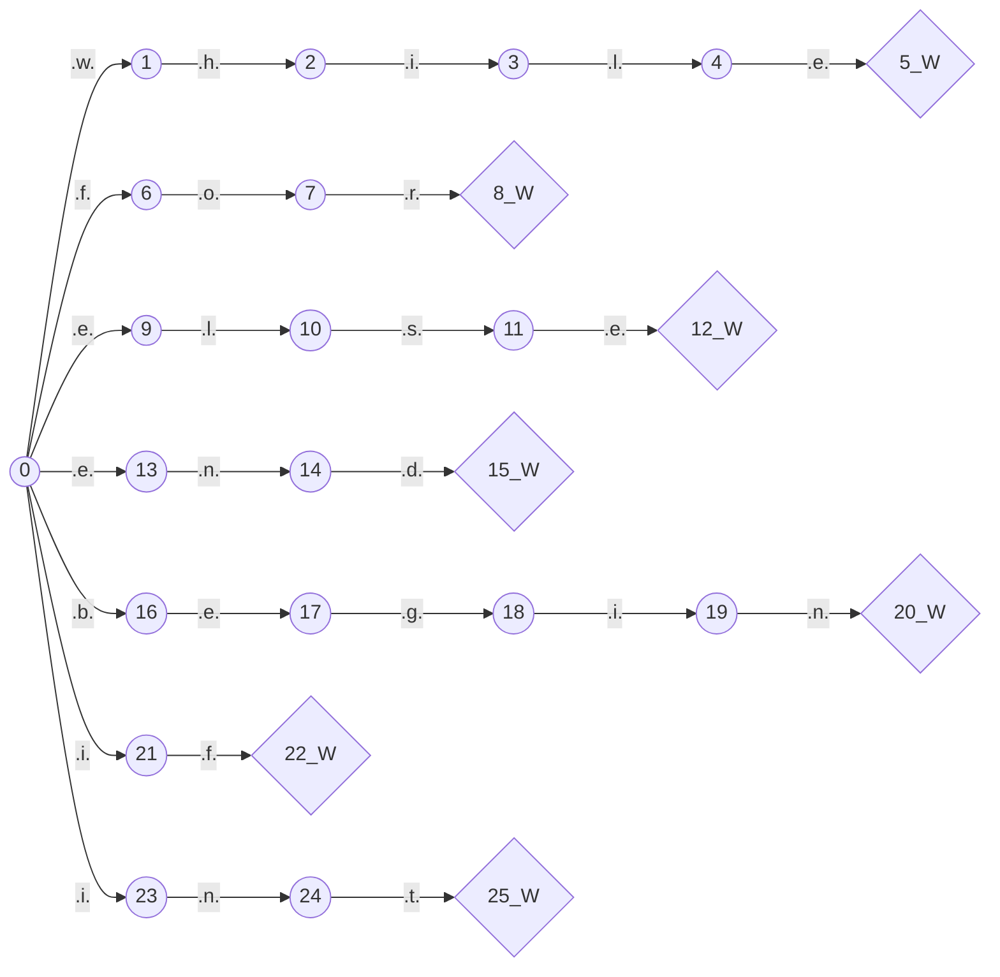

```mermaid
graph LR
id:4((4)) -- .e. --> id:5{5_W}
id:3((3)) -- .l. --> id:4((4))
id:2((2)) -- .i. --> id:3((3))
id:1((1)) -- .h. --> id:2((2))
id:0((0)) -- .w. --> id:1((1))
id:7((7)) -- .r. --> id:8{8_W}
id:6((6)) -- .o. --> id:7((7))
id:0((0)) -- .f. --> id:6((6))
id:11((11)) -- .e. --> id:12{12_W}
id:10((10)) -- .s. --> id:11((11))
id:9((9)) -- .l. --> id:10((10))
id:0((0)) -- .e. --> id:9((9))
id:14((14)) -- .d. --> id:15{15_W}
id:13((13)) -- .n. --> id:14((14))
id:0((0)) -- .e. --> id:13((13))
id:19((19)) -- .n. --> id:20{20_W}
id:18((18)) -- .i. --> id:19((19))
id:17((17)) -- .g. --> id:18((18))
id:16((16)) -- .e. --> id:17((17))
id:0((0)) -- .b. --> id:16((16))
id:21((21)) -- .f. --> id:22{22_W}
id:0((0)) -- .i. --> id:21((21))
id:24((24)) -- .t. --> id:25{25_W}
id:23((23)) -- .n. --> id:24((24))
id:0((0)) -- .i. --> id:23((23))
```
