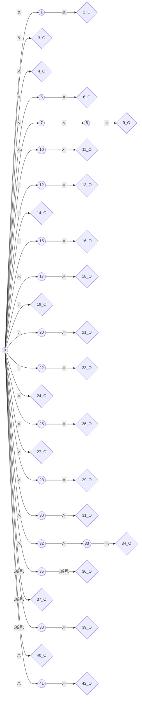

```mermaid
graph LR
id:1((1)) -- .&. --> id:2{2_O}
id:0((0)) -- .&. --> id:1((1))
id:0((0)) -- .&. --> id:3{3_O}
id:0((0)) -- .<. --> id:4{4_O}
id:5((5)) -- .=. --> id:6{6_O}
id:0((0)) -- .<. --> id:5((5))
id:8((8)) -- .=. --> id:9{9_O}
id:7((7)) -- .<. --> id:8((8))
id:0((0)) -- .<. --> id:7((7))
id:10((10)) -- .<. --> id:11{11_O}
id:0((0)) -- .<. --> id:10((10))
id:12((12)) -- .=. --> id:13{13_O}
id:0((0)) -- .:. --> id:12((12))
id:0((0)) -- .+. --> id:14{14_O}
id:15((15)) -- .=. --> id:16{16_O}
id:0((0)) -- .+. --> id:15((15))
id:17((17)) -- .+. --> id:18{18_O}
id:0((0)) -- .+. --> id:17((17))
id:0((0)) -- ./. --> id:19{19_O}
id:20((20)) -- .=. --> id:21{21_O}
id:0((0)) -- ./. --> id:20((20))
id:22((22)) -- .=. --> id:23{23_O}
id:0((0)) -- .!. --> id:22((22))
id:0((0)) -- .=. --> id:24{24_O}
id:25((25)) -- .=. --> id:26{26_O}
id:0((0)) -- .=. --> id:25((25))
id:0((0)) -- .>. --> id:27{27_O}
id:28((28)) -- .=. --> id:29{29_O}
id:0((0)) -- .>. --> id:28((28))
id:30((30)) -- .>. --> id:31{31_O}
id:0((0)) -- .>. --> id:30((30))
id:33((33)) -- .=. --> id:34{34_O}
id:32((32)) -- .>. --> id:33((33))
id:0((0)) -- .>. --> id:32((32))
id:35((35)) -- .减号. --> id:36{36_O}
id:0((0)) -- .减号. --> id:35((35))
id:0((0)) -- .减号. --> id:37{37_O}
id:38((38)) -- .=. --> id:39{39_O}
id:0((0)) -- .减号. --> id:38((38))
id:0((0)) -- .*. --> id:40{40_O}
id:41((41)) -- .=. --> id:42{42_O}
id:0((0)) -- .*. --> id:41((41))
```
