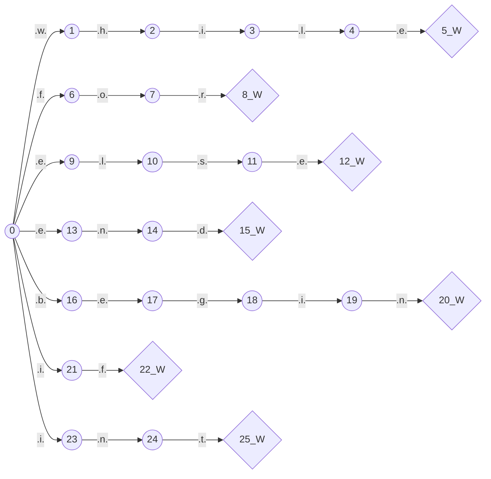
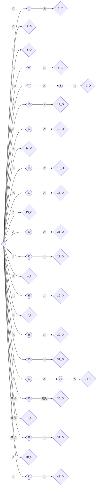
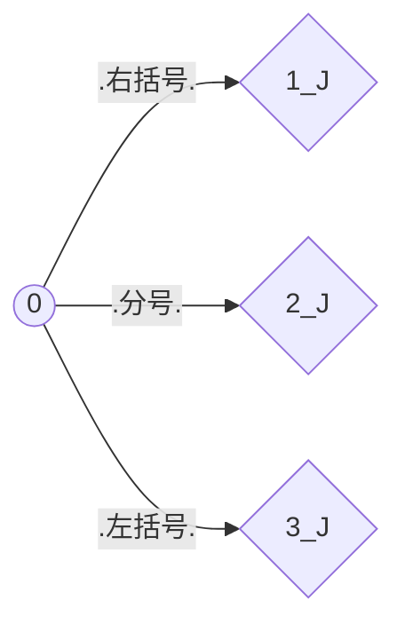

# 我是一个自动生成的MarkDown文件
## 语法
```go
D -> 0|1|2|3|4|5|6|7|8|9
L-> a|b|c|d|e|f|g|h|i|j|k|l|m|n|o|p|q|r|s|t|u|v|w|x|y|z
T -> D | L
I -> LT$
W->if|while|for|int|else|end|begin
O -> > | < | >= | <= | = | ==  | <<= | << | >> | --| - | := | + | * | / | += | -= |/= | *= | >>= | != | && | & | ++
J -> ; | ( | )
Z -> D@
X -> D@.D@
N -> X|Z
K -> (  |  ) 
Q -> KXK
```
## 自动机
### 关键字状态机.md

### 小数状态机.md
状态机过于庞大
### 操作符状态机.md

### 整数状态机.md
状态机过于庞大
### 标识符状态机.md
状态机过于庞大
### 界符状态机.md

## 种别码
索引|单词|类别|种别码
--|--|--|--
1|`if`|`关键字`|`1`
2|`int`|`关键字`|`2`
3|`while`|`关键字`|`3`
4|`for`|`关键字`|`4`
5|`else`|`关键字`|`5`
6|`end`|`关键字`|`6`
7|`begin`|`关键字`|`7`
8|`!=`|`操作符`|`8`
9|`&&`|`操作符`|`9`
10|`&`|`操作符`|`10`
11|`<`|`操作符`|`11`
12|`<=`|`操作符`|`12`
13|`<<=`|`操作符`|`13`
14|`<<`|`操作符`|`14`
15|`:=`|`操作符`|`15`
16|`+`|`操作符`|`16`
17|`+=`|`操作符`|`17`
18|`++`|`操作符`|`18`
19|`/`|`操作符`|`19`
20|`/=`|`操作符`|`20`
21|`*`|`操作符`|`21`
22|`*=`|`操作符`|`22`
23|`=`|`操作符`|`23`
24|`==`|`操作符`|`24`
25|`>`|`操作符`|`25`
26|`>=`|`操作符`|`26`
27|`>>`|`操作符`|`27`
28|`>>=`|`操作符`|`28`
29|`--`|`操作符`|`29`
30|`-`|`操作符`|`30`
31|`-=`|`操作符`|`31`
32|`)`|`界符`|`32`
33|`;`|`界符`|`33`
34|`(`|`界符`|`34`
35| |`标识符`|`10086`
36| |`整数`|`1008611`
37| |`小数`|`12345`
## 被识别的源代码
```go
a := 10.5689
b := 457
c = a+b-d
e := 0.5688
begin
        begin
                begin
                 a := 1
                end;
          begin
                 b:=1
    end;
    q:=10
        end;
        x:=9<<510455454;
        y:=11;
        z:=12
        x+=10;
        p:=20;
        t<<=10
        p = p<<1
        k := p && p
        g--
        t--;
        aa+=1;
        bb-=12;
        cc*=123;
        dd/=1234;
        ee>>=12345;
        ff<<=123456;
        gg++;
end
#~

```
## 识别出的所有Token
索引|值|类型|种别码
--|--|--|--
1|`a`|`标识符`|`10086`
2|`:=`|`操作符`|`15`
3|`10.5689`|`小数`|`12345`
4|`b`|`标识符`|`10086`
5|`:=`|`操作符`|`15`
6|`457`|`整数`|`1008611`
7|`c`|`标识符`|`10086`
8|`=`|`操作符`|`23`
9|`a`|`标识符`|`10086`
10|`+`|`操作符`|`16`
11|`b`|`标识符`|`10086`
12|`-`|`操作符`|`30`
13|`d`|`标识符`|`10086`
14|`e`|`标识符`|`10086`
15|`:=`|`操作符`|`15`
16|`0.5688`|`小数`|`12345`
17|`begin`|`关键字`|`7`
18|`begin`|`关键字`|`7`
19|`begin`|`关键字`|`7`
20|`a`|`标识符`|`10086`
21|`:=`|`操作符`|`15`
22|`1`|`整数`|`1008611`
23|`end`|`关键字`|`6`
24|`;`|`界符`|`33`
25|`begin`|`关键字`|`7`
26|`b`|`标识符`|`10086`
27|`:=`|`操作符`|`15`
28|`1`|`整数`|`1008611`
29|`end`|`关键字`|`6`
30|`;`|`界符`|`33`
31|`q`|`标识符`|`10086`
32|`:=`|`操作符`|`15`
33|`10`|`整数`|`1008611`
34|`end`|`关键字`|`6`
35|`;`|`界符`|`33`
36|`x`|`标识符`|`10086`
37|`:=`|`操作符`|`15`
38|`9`|`整数`|`1008611`
39|`<<`|`操作符`|`14`
40|`510455454`|`整数`|`1008611`
41|`;`|`界符`|`33`
42|`y`|`标识符`|`10086`
43|`:=`|`操作符`|`15`
44|`11`|`整数`|`1008611`
45|`;`|`界符`|`33`
46|`z`|`标识符`|`10086`
47|`:=`|`操作符`|`15`
48|`12`|`整数`|`1008611`
49|`x`|`标识符`|`10086`
50|`+=`|`操作符`|`17`
51|`10`|`整数`|`1008611`
52|`;`|`界符`|`33`
53|`p`|`标识符`|`10086`
54|`:=`|`操作符`|`15`
55|`20`|`整数`|`1008611`
56|`;`|`界符`|`33`
57|`t`|`标识符`|`10086`
58|`<<=`|`操作符`|`13`
59|`10`|`整数`|`1008611`
60|`p`|`标识符`|`10086`
61|`=`|`操作符`|`23`
62|`p`|`标识符`|`10086`
63|`<<`|`操作符`|`14`
64|`1`|`整数`|`1008611`
65|`k`|`标识符`|`10086`
66|`:=`|`操作符`|`15`
67|`p`|`标识符`|`10086`
68|`&&`|`操作符`|`9`
69|`p`|`标识符`|`10086`
70|`g`|`标识符`|`10086`
71|`--`|`操作符`|`29`
72|`t`|`标识符`|`10086`
73|`--`|`操作符`|`29`
74|`;`|`界符`|`33`
75|`aa`|`标识符`|`10086`
76|`+=`|`操作符`|`17`
77|`1`|`整数`|`1008611`
78|`;`|`界符`|`33`
79|`bb`|`标识符`|`10086`
80|`-=`|`操作符`|`31`
81|`12`|`整数`|`1008611`
82|`;`|`界符`|`33`
83|`cc`|`标识符`|`10086`
84|`*=`|`操作符`|`22`
85|`123`|`整数`|`1008611`
86|`;`|`界符`|`33`
87|`dd`|`标识符`|`10086`
88|`/=`|`操作符`|`20`
89|`1234`|`整数`|`1008611`
90|`;`|`界符`|`33`
91|`ee`|`标识符`|`10086`
92|`>>=`|`操作符`|`28`
93|`12345`|`整数`|`1008611`
94|`;`|`界符`|`33`
95|`ff`|`标识符`|`10086`
96|`<<=`|`操作符`|`13`
97|`123456`|`整数`|`1008611`
98|`;`|`界符`|`33`
99|`gg`|`标识符`|`10086`
100|`++`|`操作符`|`18`
101|`;`|`界符`|`33`
102|`end`|`关键字`|`6`
