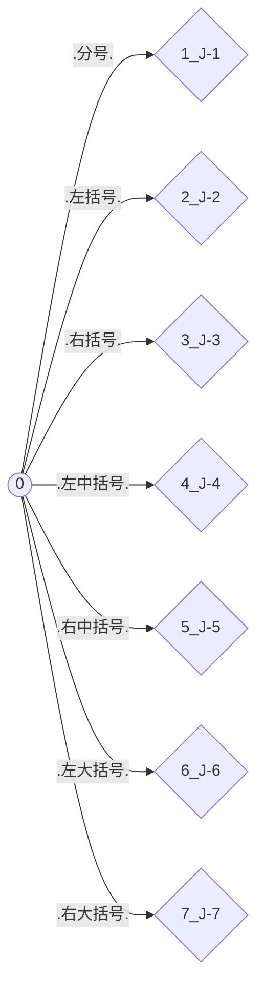
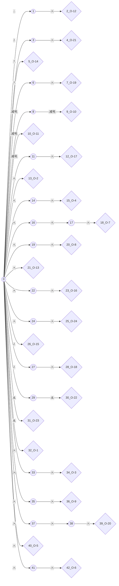
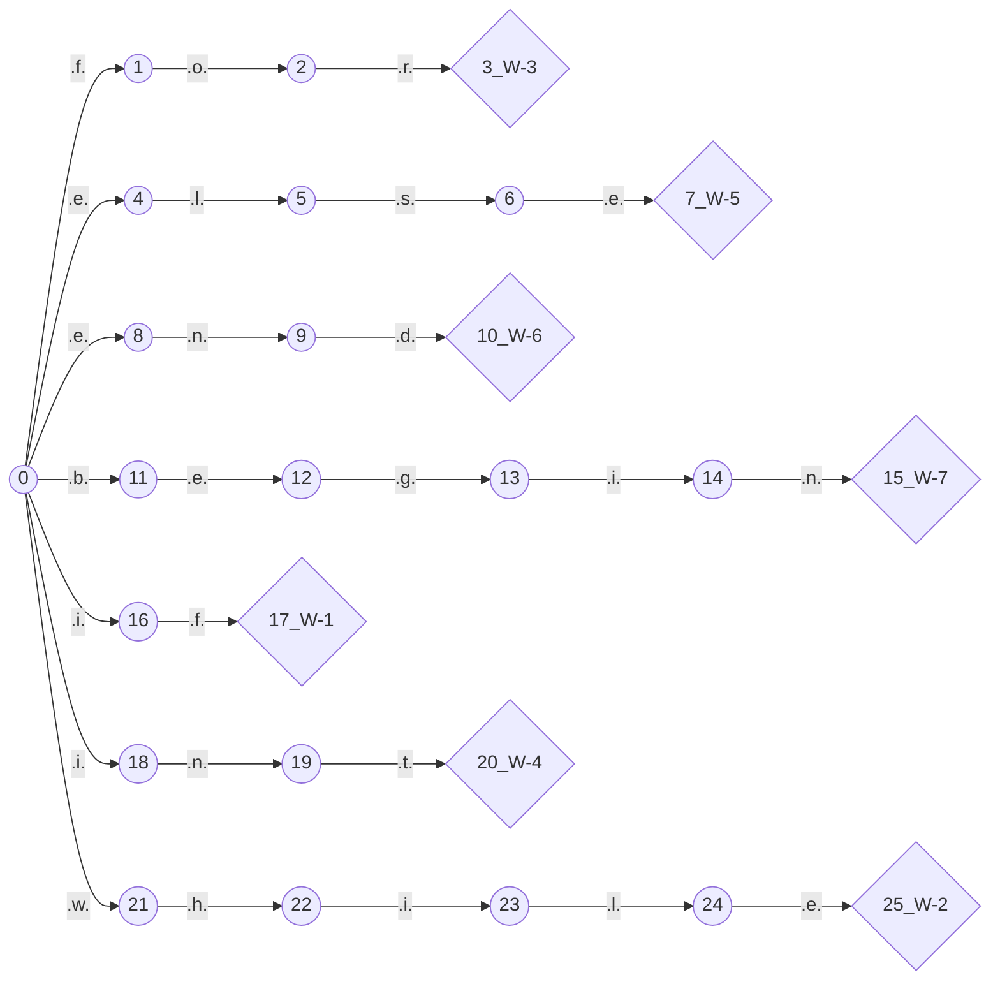

@[TOC]
# 我是一个自动生成的MarkDown文件
## 语法
特殊符号|类型|种别码编码规则|匹配
--|--|--|--
D|数字|-1|0,1,2,3,4,5,6,7,8,9
L|字母|-1|a,b,c,d,e,f,g,h,i,j,k,l,m,n,o,p,q,r,s,t,u,v,w,x,y,z
T|字母或数字|-1|D,L
W|关键字|0|if,while,for,int,else,end,begin
O|操作符|0|>,<,>=,<=,=,==,<<=,<<,>>,--,-,:=,+,*,/,+=,-=,/=,*=,>>=,!=,&&,&,++
J|界符|0|;,(,),[,],{,}
I|标识符|10086|LT$
Z|整数|1008611|D@
X|小数|1008612|Z.Z
S|字符串|1008613|"T$"
## 自动机
### I 状态机
状态机过于庞大
### J 状态机

### O 状态机

### S 状态机
状态机过于庞大
### W 状态机

### X 状态机
状态机过于庞大
### Z 状态机
状态机过于庞大
### 最终状态机
状态机过于庞大
## 种别码
索引|单词|类别|种别码
--|--|--|--
1|`}`|`界符`|`7`
2|`/`|`操作符`|`15`
3|`(`|`界符`|`2`
4|`=`|`操作符`|`5`
5|`==`|`操作符`|`6`
6|`<<=`|`操作符`|`7`
7|`-`|`操作符`|`11`
8|`++`|`操作符`|`24`
9|`int`|`关键字`|`4`
10|`>`|`操作符`|`1`
11|`&`|`操作符`|`23`
12|`;`|`界符`|`1`
13|`+`|`操作符`|`13`
14|`>>=`|`操作符`|`20`
15|`:=`|`操作符`|`12`
16|`for`|`关键字`|`3`
17|`end`|`关键字`|`6`
18|`]`|`界符`|`5`
19|`<=`|`操作符`|`4`
20|`&&`|`操作符`|`22`
21|`>>`|`操作符`|`9`
22|`*=`|`操作符`|`19`
23|`[`|`界符`|`4`
24|`if`|`关键字`|`1`
25|`begin`|`关键字`|`7`
26|`--`|`操作符`|`10`
27|`*`|`操作符`|`14`
28|`+=`|`操作符`|`16`
29|`/=`|`操作符`|`18`
30|`!=`|`操作符`|`21`
31|`)`|`界符`|`3`
32|`while`|`关键字`|`2`
33|`<<`|`操作符`|`8`
34|`{`|`界符`|`6`
35|`>=`|`操作符`|`3`
36|`-=`|`操作符`|`17`
37|`else`|`关键字`|`5`
38|`<`|`操作符`|`2`
39|``|`整数`|`1008611`
40|``|`小数`|`1008612`
41|``|`字符串`|`1008613`
42|``|`标识符`|`10086`
## 被识别的源代码
```go
a := 10.5689
b := 457
c = a+b-d
e := 0.5688
f := "hello"
begin
        begin
                begin
                 a := 1
                end;
          begin
                 b:=1
    end;
    q:=10
        end;
        x:=9<<510455454;
        y:=11;
        z:=12
        x+=10;
        p:=20;
        t<<=10
        p = p<<1
        k := p && p
        g--
        t--;
        aa+=1;
        bb-=12;
        cc*=123;
        dd/=1234;
        ee>>=12345;
        ff<<=123456;
        gg++;
end
#~

```
## 识别出的所有Token
索引|值|类型|种别码
--|--|--|--
1|`gg`|`标识符`|`10086`
2|`:=`|`操作符`|`12`
3|`0.5688`|`小数`|`1008612`
4|`gg`|`标识符`|`10086`
5|`:=`|`操作符`|`12`
6|`123456`|`整数`|`1008611`
7|`gg`|`标识符`|`10086`
8|`=`|`操作符`|`5`
9|`gg`|`标识符`|`10086`
10|`+`|`操作符`|`13`
11|`gg`|`标识符`|`10086`
12|`-`|`操作符`|`11`
13|`gg`|`标识符`|`10086`
14|`gg`|`标识符`|`10086`
15|`:=`|`操作符`|`12`
16|`0.5688`|`小数`|`1008612`
17|`gg`|`标识符`|`10086`
18|`:=`|`操作符`|`12`
19|`"hello"`|`字符串`|`1008613`
20|`begin`|`关键字`|`7`
21|`begin`|`关键字`|`7`
22|`begin`|`关键字`|`7`
23|`gg`|`标识符`|`10086`
24|`:=`|`操作符`|`12`
25|`123456`|`整数`|`1008611`
26|`end`|`关键字`|`6`
27|`;`|`界符`|`1`
28|`begin`|`关键字`|`7`
29|`gg`|`标识符`|`10086`
30|`:=`|`操作符`|`12`
31|`123456`|`整数`|`1008611`
32|`end`|`关键字`|`6`
33|`;`|`界符`|`1`
34|`gg`|`标识符`|`10086`
35|`:=`|`操作符`|`12`
36|`123456`|`整数`|`1008611`
37|`end`|`关键字`|`6`
38|`;`|`界符`|`1`
39|`gg`|`标识符`|`10086`
40|`:=`|`操作符`|`12`
41|`123456`|`整数`|`1008611`
42|`<<`|`操作符`|`8`
43|`123456`|`整数`|`1008611`
44|`;`|`界符`|`1`
45|`gg`|`标识符`|`10086`
46|`:=`|`操作符`|`12`
47|`123456`|`整数`|`1008611`
48|`;`|`界符`|`1`
49|`gg`|`标识符`|`10086`
50|`:=`|`操作符`|`12`
51|`123456`|`整数`|`1008611`
52|`gg`|`标识符`|`10086`
53|`+=`|`操作符`|`16`
54|`123456`|`整数`|`1008611`
55|`;`|`界符`|`1`
56|`gg`|`标识符`|`10086`
57|`:=`|`操作符`|`12`
58|`123456`|`整数`|`1008611`
59|`;`|`界符`|`1`
60|`gg`|`标识符`|`10086`
61|`<<=`|`操作符`|`7`
62|`123456`|`整数`|`1008611`
63|`gg`|`标识符`|`10086`
64|`=`|`操作符`|`5`
65|`gg`|`标识符`|`10086`
66|`<<`|`操作符`|`8`
67|`123456`|`整数`|`1008611`
68|`gg`|`标识符`|`10086`
69|`:=`|`操作符`|`12`
70|`gg`|`标识符`|`10086`
71|`&&`|`操作符`|`22`
72|`gg`|`标识符`|`10086`
73|`gg`|`标识符`|`10086`
74|`--`|`操作符`|`10`
75|`gg`|`标识符`|`10086`
76|`--`|`操作符`|`10`
77|`;`|`界符`|`1`
78|`gg`|`标识符`|`10086`
79|`+=`|`操作符`|`16`
80|`123456`|`整数`|`1008611`
81|`;`|`界符`|`1`
82|`gg`|`标识符`|`10086`
83|`-=`|`操作符`|`17`
84|`123456`|`整数`|`1008611`
85|`;`|`界符`|`1`
86|`gg`|`标识符`|`10086`
87|`*=`|`操作符`|`19`
88|`123456`|`整数`|`1008611`
89|`;`|`界符`|`1`
90|`gg`|`标识符`|`10086`
91|`/=`|`操作符`|`18`
92|`123456`|`整数`|`1008611`
93|`;`|`界符`|`1`
94|`gg`|`标识符`|`10086`
95|`>>=`|`操作符`|`20`
96|`123456`|`整数`|`1008611`
97|`;`|`界符`|`1`
98|`gg`|`标识符`|`10086`
99|`<<=`|`操作符`|`7`
100|`123456`|`整数`|`1008611`
101|`;`|`界符`|`1`
102|`gg`|`标识符`|`10086`
103|`++`|`操作符`|`24`
104|`;`|`界符`|`1`
105|`end`|`关键字`|`6`
