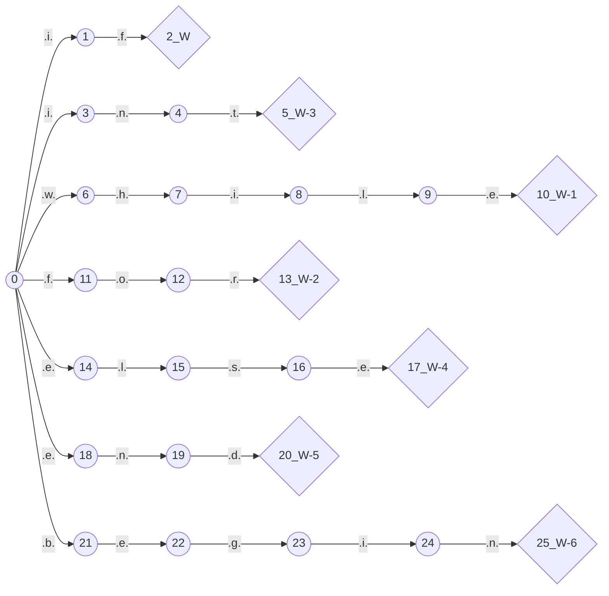
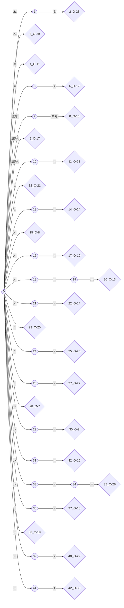
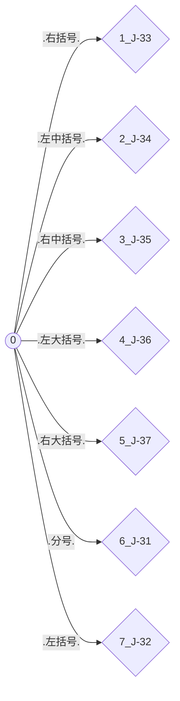

@[TOC]
# 我是一个自动生成的MarkDown文件
## 语法
```go
D -> 0 | 1 | 2 | 3 | 4 | 5 | 6 | 7 | 8 | 9
L -> a | b | c | d | e | f | g | h | i | j | k | l | m | n | o | p | q | r | s | t | u | v | w | x | y | z 
T -> D | L
I -> LT$
W -> if | while | for | int | else | end | begin
O -> > | < | >= | <= | = | ==  | <<= | << | >> | --| - | := | + | * | / | += | -= |/= | *= | >>= | != | && | & | ++
J -> ; | ( | ) | [ | ] | { | }
Z -> D@
X -> Z.Z
```
## 自动机
### 关键字状态机

### 小数状态机
状态机过于庞大
### 操作符状态机

### 整数状态机
状态机过于庞大
### 最终状态机
状态机过于庞大
### 标识符状态机
状态机过于庞大
### 界符状态机

## 种别码
索引|单词|类别|种别码
--|--|--|--
1|`)`|`界符`|`33`
2|`else`|`关键字`|`4`
3|`<<`|`操作符`|`14`
4|`&&`|`操作符`|`28`
5|`+=`|`操作符`|`22`
6|`>=`|`操作符`|`9`
7|`>>`|`操作符`|`15`
8|`:=`|`操作符`|`18`
9|`*=`|`操作符`|`25`
10|`++`|`操作符`|`30`
11|`[`|`界符`|`34`
12|`while`|`关键字`|`1`
13|`for`|`关键字`|`2`
14|`==`|`操作符`|`12`
15|`<<=`|`操作符`|`13`
16|`--`|`操作符`|`16`
17|`-`|`操作符`|`17`
18|`&`|`操作符`|`29`
19|`{`|`界符`|`36`
20|`end`|`关键字`|`5`
21|`<`|`操作符`|`8`
22|`=`|`操作符`|`11`
23|`(`|`界符`|`32`
24|`}`|`界符`|`37`
25|`*`|`操作符`|`20`
26|`!=`|`操作符`|`27`
27|`if`|`关键字`|`0`
28|`>`|`操作符`|`7`
29|`+`|`操作符`|`19`
30|`/`|`操作符`|`21`
31|`/=`|`操作符`|`24`
32|`>>=`|`操作符`|`26`
33|`;`|`界符`|`31`
34|`]`|`界符`|`35`
35|`int`|`关键字`|`3`
36|`begin`|`关键字`|`6`
37|`<=`|`操作符`|`10`
38|`-=`|`操作符`|`23`
39|``|`标识符`|`7300`
40|``|`小数`|`8800`
41|``|`整数`|`9000`
## 被识别的源代码
```go
a := 10.5689
b := 457
c = a+b-d
e := 0.5688
begin
        begin
                begin
                 a := 1
                end;
          begin
                 b:=1
    end;
    q:=10
        end;
        x:=9<<510455454;
        y:=11;
        z:=12
        x+=10;
        p:=20;
        t<<=10
        p = p<<1
        k := p && p
        g--
        t--;
        aa+=1;
        bb-=12;
        cc*=123;
        dd/=1234;
        ee>>=12345;
        ff<<=123456;
        gg++;
end
#~

```
## 识别出的所有Token
索引|值|类型|种别码
--|--|--|--
1|`gg`|`标识符`|`7300`
2|`:=`|`操作符`|`18`
3|`0.5688`|`小数`|`8800`
4|`gg`|`标识符`|`7300`
5|`:=`|`操作符`|`18`
6|`123456`|`整数`|`9000`
7|`gg`|`标识符`|`7300`
8|`=`|`操作符`|`11`
9|`gg`|`标识符`|`7300`
10|`+`|`操作符`|`19`
11|`gg`|`标识符`|`7300`
12|`-`|`操作符`|`17`
13|`gg`|`标识符`|`7300`
14|`gg`|`标识符`|`7300`
15|`:=`|`操作符`|`18`
16|`0.5688`|`小数`|`8800`
17|`begin`|`关键字`|`6`
18|`begin`|`关键字`|`6`
19|`begin`|`关键字`|`6`
20|`gg`|`标识符`|`7300`
21|`:=`|`操作符`|`18`
22|`123456`|`整数`|`9000`
23|`end`|`关键字`|`5`
24|`;`|`界符`|`31`
25|`begin`|`关键字`|`6`
26|`gg`|`标识符`|`7300`
27|`:=`|`操作符`|`18`
28|`123456`|`整数`|`9000`
29|`end`|`关键字`|`5`
30|`;`|`界符`|`31`
31|`gg`|`标识符`|`7300`
32|`:=`|`操作符`|`18`
33|`123456`|`整数`|`9000`
34|`end`|`关键字`|`5`
35|`;`|`界符`|`31`
36|`gg`|`标识符`|`7300`
37|`:=`|`操作符`|`18`
38|`123456`|`整数`|`9000`
39|`<<`|`操作符`|`14`
40|`123456`|`整数`|`9000`
41|`;`|`界符`|`31`
42|`gg`|`标识符`|`7300`
43|`:=`|`操作符`|`18`
44|`123456`|`整数`|`9000`
45|`;`|`界符`|`31`
46|`gg`|`标识符`|`7300`
47|`:=`|`操作符`|`18`
48|`123456`|`整数`|`9000`
49|`gg`|`标识符`|`7300`
50|`+=`|`操作符`|`22`
51|`123456`|`整数`|`9000`
52|`;`|`界符`|`31`
53|`gg`|`标识符`|`7300`
54|`:=`|`操作符`|`18`
55|`123456`|`整数`|`9000`
56|`;`|`界符`|`31`
57|`gg`|`标识符`|`7300`
58|`<<=`|`操作符`|`13`
59|`123456`|`整数`|`9000`
60|`gg`|`标识符`|`7300`
61|`=`|`操作符`|`11`
62|`gg`|`标识符`|`7300`
63|`<<`|`操作符`|`14`
64|`123456`|`整数`|`9000`
65|`gg`|`标识符`|`7300`
66|`:=`|`操作符`|`18`
67|`gg`|`标识符`|`7300`
68|`&&`|`操作符`|`28`
69|`gg`|`标识符`|`7300`
70|`gg`|`标识符`|`7300`
71|`--`|`操作符`|`16`
72|`gg`|`标识符`|`7300`
73|`--`|`操作符`|`16`
74|`;`|`界符`|`31`
75|`gg`|`标识符`|`7300`
76|`+=`|`操作符`|`22`
77|`123456`|`整数`|`9000`
78|`;`|`界符`|`31`
79|`gg`|`标识符`|`7300`
80|`-=`|`操作符`|`23`
81|`123456`|`整数`|`9000`
82|`;`|`界符`|`31`
83|`gg`|`标识符`|`7300`
84|`*=`|`操作符`|`25`
85|`123456`|`整数`|`9000`
86|`;`|`界符`|`31`
87|`gg`|`标识符`|`7300`
88|`/=`|`操作符`|`24`
89|`123456`|`整数`|`9000`
90|`;`|`界符`|`31`
91|`gg`|`标识符`|`7300`
92|`>>=`|`操作符`|`26`
93|`123456`|`整数`|`9000`
94|`;`|`界符`|`31`
95|`gg`|`标识符`|`7300`
96|`<<=`|`操作符`|`13`
97|`123456`|`整数`|`9000`
98|`;`|`界符`|`31`
99|`gg`|`标识符`|`7300`
100|`++`|`操作符`|`30`
101|`;`|`界符`|`31`
102|`end`|`关键字`|`5`
