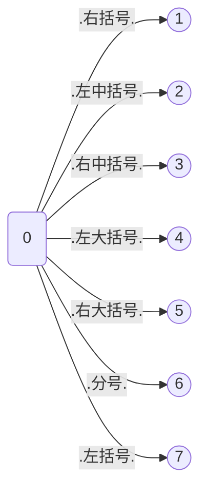
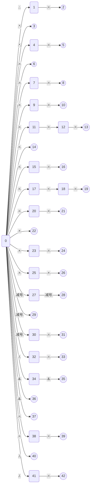
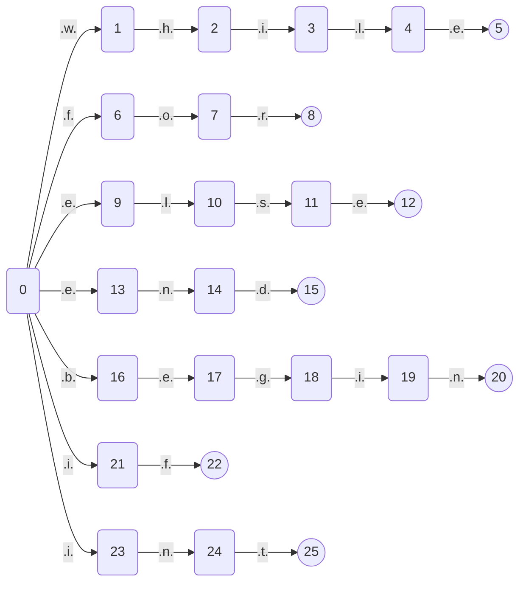

@[TOC]
# 我是一个自动生成的MarkDown文件
## 语法
特殊符号|类型|种别码编码规则|匹配
--|--|--|--
D|数字|-1|0,1,2,3,4,5,6,7,8,9
L|字母|-1|a,b,c,d,e,f,g,h,i,j,k,l,m,n,o,p,q,r,s,t,u,v,w,x,y,z
T|字母或数字|-1|D,L
W|关键字|0|if,while,for,int,else,end,begin
O|操作符|0|>,<,>=,<=,=,==,<<=,<<,>>,--,-,:=,+, * ,/,+=,-=,/=, *= ,>>=,!=,&&,&,++
J|界符|0|;,(,), [ , ] ,{,}
I|标识符|10086|LT$
Z|整数|1008611|D@
X|小数|1008612|Z.Z
S|字符串|1008613|"T$"
## 自动机
### I 状态机
状态机过于庞大
### J 状态机

### O 状态机

### S 状态机
状态机过于庞大
### W 状态机

### X 状态机
状态机过于庞大
### Z 状态机
状态机过于庞大
### 最终状态机
状态机过于庞大
## 种别码
索引|单词|类别|种别码
--|--|--|--
1|`<=`|`操作符`|`11`
2|`--`|`操作符`|`17`
3|`+`|`操作符`|`20`
4|`>>=`|`操作符`|`27`
5|`!=`|`操作符`|`28`
6|`&`|`操作符`|`30`
7|`]`|`界符`|`36`
8|`{`|`界符`|`37`
9|`if`|`关键字`|`1`
10|`>>`|`操作符`|`16`
11|`-=`|`操作符`|`24`
12|`/`|`操作符`|`22`
13|`;`|`界符`|`32`
14|`<<`|`操作符`|`15`
15|`:=`|`操作符`|`19`
16|`(`|`界符`|`33`
17|`}`|`界符`|`38`
18|`while`|`关键字`|`2`
19|`end`|`关键字`|`6`
20|`>=`|`操作符`|`10`
21|`*=`|`操作符`|`26`
22|`++`|`操作符`|`31`
23|`=`|`操作符`|`12`
24|`==`|`操作符`|`13`
25|`*`|`操作符`|`21`
26|`&&`|`操作符`|`29`
27|`[`|`界符`|`35`
28|`begin`|`关键字`|`7`
29|`>`|`操作符`|`8`
30|`/=`|`操作符`|`25`
31|`+=`|`操作符`|`23`
32|`else`|`关键字`|`5`
33|`<<=`|`操作符`|`14`
34|`-`|`操作符`|`18`
35|`)`|`界符`|`34`
36|`for`|`关键字`|`3`
37|`int`|`关键字`|`4`
38|`<`|`操作符`|`9`
39|``|`标识符`|`10086`
40|``|`整数`|`1008611`
41|``|`小数`|`1008612`
42|``|`字符串`|`1008613`
## 被识别的源代码
```go
a := 10.5689
b := 457
c = a+b-d
e := 0.5688
f := "hello"
begin
        begin
                begin
                 a := 1
                end;
          begin
                 b:=1
    end;
    q:=10
        end;
        x:=9<<510455454;
        y:=11;
        z:=12
        x+=10;
        p:=20;
        t<<=10
        p = p<<1
        k := p && p
        g--
        t--;
        aa+=1;
        bb-=12;
        cc*=123;
        dd/=1234;
        ee>>=12345;
        ff<<=123456;
        gg++;
end
#~

```
## 识别出的所有Token
索引|值|类型|种别码
--|--|--|--
1|`a`|`标识符`|`10086`
2|`:=`|`操作符`|`19`
3|`10.5689`|`小数`|`1008612`
4|`b`|`标识符`|`10086`
5|`:=`|`操作符`|`19`
6|`457`|`整数`|`1008611`
7|`c`|`标识符`|`10086`
8|`=`|`操作符`|`12`
9|`a`|`标识符`|`10086`
10|`+`|`操作符`|`20`
11|`b`|`标识符`|`10086`
12|`-`|`操作符`|`18`
13|`d`|`标识符`|`10086`
14|`e`|`标识符`|`10086`
15|`:=`|`操作符`|`19`
16|`0.5688`|`小数`|`1008612`
17|`f`|`标识符`|`10086`
18|`:=`|`操作符`|`19`
19|`"hello"`|`字符串`|`1008613`
20|`begin`|`关键字`|`7`
21|`begin`|`关键字`|`7`
22|`begin`|`关键字`|`7`
23|`a`|`标识符`|`10086`
24|`:=`|`操作符`|`19`
25|`1`|`整数`|`1008611`
26|`end`|`关键字`|`6`
27|`;`|`界符`|`32`
28|`begin`|`关键字`|`7`
29|`b`|`标识符`|`10086`
30|`:=`|`操作符`|`19`
31|`1`|`整数`|`1008611`
32|`end`|`关键字`|`6`
33|`;`|`界符`|`32`
34|`q`|`标识符`|`10086`
35|`:=`|`操作符`|`19`
36|`10`|`整数`|`1008611`
37|`end`|`关键字`|`6`
38|`;`|`界符`|`32`
39|`x`|`标识符`|`10086`
40|`:=`|`操作符`|`19`
41|`9`|`整数`|`1008611`
42|`<<`|`操作符`|`15`
43|`510455454`|`整数`|`1008611`
44|`;`|`界符`|`32`
45|`y`|`标识符`|`10086`
46|`:=`|`操作符`|`19`
47|`11`|`整数`|`1008611`
48|`;`|`界符`|`32`
49|`z`|`标识符`|`10086`
50|`:=`|`操作符`|`19`
51|`12`|`整数`|`1008611`
52|`x`|`标识符`|`10086`
53|`+=`|`操作符`|`23`
54|`10`|`整数`|`1008611`
55|`;`|`界符`|`32`
56|`p`|`标识符`|`10086`
57|`:=`|`操作符`|`19`
58|`20`|`整数`|`1008611`
59|`;`|`界符`|`32`
60|`t`|`标识符`|`10086`
61|`<<=`|`操作符`|`14`
62|`10`|`整数`|`1008611`
63|`p`|`标识符`|`10086`
64|`=`|`操作符`|`12`
65|`p`|`标识符`|`10086`
66|`<<`|`操作符`|`15`
67|`1`|`整数`|`1008611`
68|`k`|`标识符`|`10086`
69|`:=`|`操作符`|`19`
70|`p`|`标识符`|`10086`
71|`&&`|`操作符`|`29`
72|`p`|`标识符`|`10086`
73|`g`|`标识符`|`10086`
74|`--`|`操作符`|`17`
75|`t`|`标识符`|`10086`
76|`--`|`操作符`|`17`
77|`;`|`界符`|`32`
78|`aa`|`标识符`|`10086`
79|`+=`|`操作符`|`23`
80|`1`|`整数`|`1008611`
81|`;`|`界符`|`32`
82|`bb`|`标识符`|`10086`
83|`-=`|`操作符`|`24`
84|`12`|`整数`|`1008611`
85|`;`|`界符`|`32`
86|`cc`|`标识符`|`10086`
87|`*=`|`操作符`|`26`
88|`123`|`整数`|`1008611`
89|`;`|`界符`|`32`
90|`dd`|`标识符`|`10086`
91|`/=`|`操作符`|`25`
92|`1234`|`整数`|`1008611`
93|`;`|`界符`|`32`
94|`ee`|`标识符`|`10086`
95|`>>=`|`操作符`|`27`
96|`12345`|`整数`|`1008611`
97|`;`|`界符`|`32`
98|`ff`|`标识符`|`10086`
99|`<<=`|`操作符`|`14`
100|`123456`|`整数`|`1008611`
101|`;`|`界符`|`32`
102|`gg`|`标识符`|`10086`
103|`++`|`操作符`|`31`
104|`;`|`界符`|`32`
105|`end`|`关键字`|`6`
