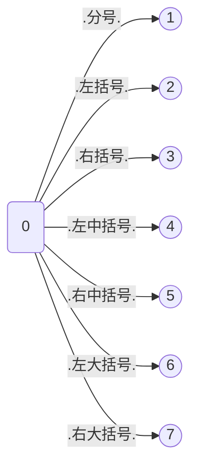
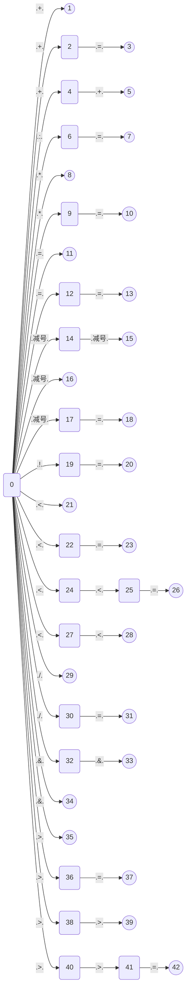
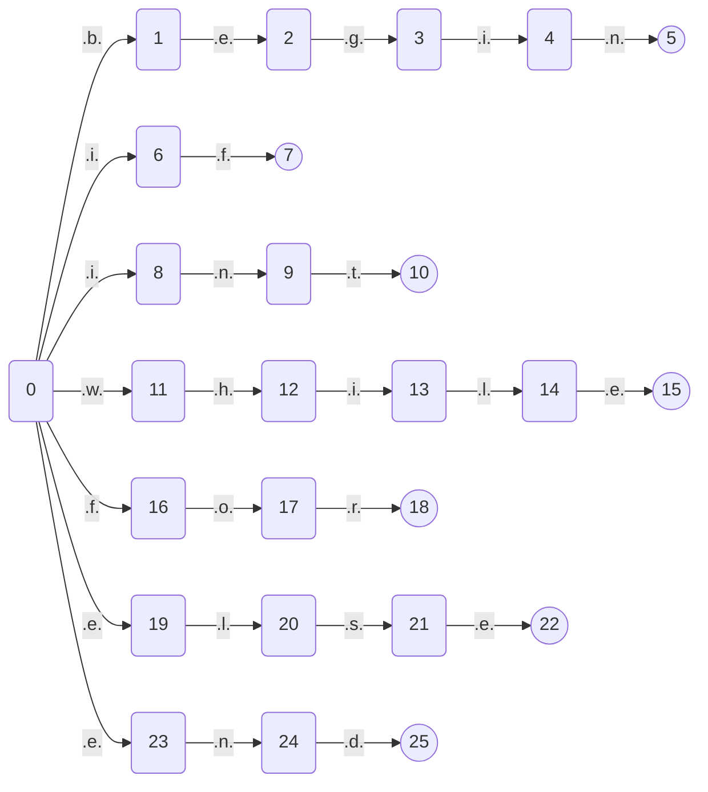

@[TOC]
# 我是一个自动生成的MarkDown文件
## 语法
索引|特殊符号|类型|种别码编码规则|匹配
--|--|--|--|--
1|`D`|`数字`|`-1`|`0`,`1`,`2`,`3`,`4`,`5`,`6`,`7`,`8`,`9`
2|`L`|`字母`|`-1`|`a`,`b`,`c`,`d`,`e`,`f`,`g`,`h`,`i`,`j`,`k`,`l`,`m`,`n`,`o`,`p`,`q`,`r`,`s`,`t`,`u`,`v`,`w`,`x`,`y`,`z`
3|`T`|`字母或数字`|`-1`|`D`,`L`
4|`W`|`关键字`|`0`|`if`,`while`,`for`,`int`,`else`,`end`,`begin`
5|`O`|`操作符`|`0`|`>`,`<`,`>=`,`<=`,`=`,`==`,`<<=`,`<<`,`>>`,`--`,`-`,`:=`,`+`,`*`,`/`,`+=`,`-=`,`/=`,`*=`,`>>=`,`!=`,`&&`,`&`,`++`
6|`J`|`界符`|`0`|`;`,`(`,`)`,`[`,`]`,`{`,`}`
7|`I`|`标识符`|`100`|`LT$`
8|`Z`|`整数`|`101`|`D@`
9|`X`|`小数`|`102`|`Z.Z`
10|`S`|`字符串`|`103`|`"T$"`
## 自动机
### I 状态机
状态机过于庞大
### J 状态机

### O 状态机

### S 状态机
状态机过于庞大
### W 状态机

### X 状态机
状态机过于庞大
### Z 状态机
状态机过于庞大
### 最终状态机
状态机过于庞大
## 种别码
索引|单词|类别|种别码
--|--|--|--
1|`&&`|`操作符`|`29`
2|`;`|`界符`|`32`
3|`int`|`关键字`|`4`
4|`end`|`关键字`|`6`
5|`>>=`|`操作符`|`27`
6|`&`|`操作符`|`30`
7|`(`|`界符`|`33`
8|`>`|`操作符`|`8`
9|`>>`|`操作符`|`16`
10|`else`|`关键字`|`5`
11|`-`|`操作符`|`18`
12|`*`|`操作符`|`21`
13|`/`|`操作符`|`22`
14|`+=`|`操作符`|`23`
15|`-=`|`操作符`|`24`
16|`if`|`关键字`|`1`
17|`while`|`关键字`|`2`
18|`)`|`界符`|`34`
19|`{`|`界符`|`37`
20|`for`|`关键字`|`3`
21|`<<=`|`操作符`|`14`
22|`:=`|`操作符`|`19`
23|`/=`|`操作符`|`25`
24|`begin`|`关键字`|`7`
25|`=`|`操作符`|`12`
26|`+`|`操作符`|`20`
27|`<=`|`操作符`|`11`
28|`<<`|`操作符`|`15`
29|`*=`|`操作符`|`26`
30|`++`|`操作符`|`31`
31|`<`|`操作符`|`9`
32|`--`|`操作符`|`17`
33|`!=`|`操作符`|`28`
34|`[`|`界符`|`35`
35|`]`|`界符`|`36`
36|`}`|`界符`|`38`
37|`>=`|`操作符`|`10`
38|`==`|`操作符`|`13`
39|``|`字符串`|`103`
40|``|`标识符`|`100`
41|``|`整数`|`101`
42|``|`小数`|`102`
## 被识别的源代码
```go
a := 10.5689
b := 457
c = a+b-d
e := 0.5688
f := "hello"
begin
        begin
                begin
                 a := 1
                end;
          begin
                 b:=1
    end;
    q:=10
        end;
        x:=9<<510455454;
        y:=11;
        z:=12
        x+=10;
        p:=20;
        t<<=10
        p = p<<1
        k := p && p
        g--
        t--;
        aa+=1;
        bb-=12;
        cc*=123;
        dd/=1234;
        ee>>=12345;
        ff<<=123456;
        gg++;
end
#~

```
## 识别出的所有Token
索引|值|类型|种别码
--|--|--|--
1|`a`|`标识符`|`100`
2|`:=`|`操作符`|`19`
3|`10.5689`|`小数`|`102`
4|`b`|`标识符`|`100`
5|`:=`|`操作符`|`19`
6|`457`|`整数`|`101`
7|`c`|`标识符`|`100`
8|`=`|`操作符`|`12`
9|`a`|`标识符`|`100`
10|`+`|`操作符`|`20`
11|`b`|`标识符`|`100`
12|`-`|`操作符`|`18`
13|`d`|`标识符`|`100`
14|`e`|`标识符`|`100`
15|`:=`|`操作符`|`19`
16|`0.5688`|`小数`|`102`
17|`f`|`标识符`|`100`
18|`:=`|`操作符`|`19`
19|`"hello"`|`字符串`|`103`
20|`begin`|`关键字`|`7`
21|`begin`|`关键字`|`7`
22|`begin`|`关键字`|`7`
23|`a`|`标识符`|`100`
24|`:=`|`操作符`|`19`
25|`1`|`整数`|`101`
26|`end`|`关键字`|`6`
27|`;`|`界符`|`32`
28|`begin`|`关键字`|`7`
29|`b`|`标识符`|`100`
30|`:=`|`操作符`|`19`
31|`1`|`整数`|`101`
32|`end`|`关键字`|`6`
33|`;`|`界符`|`32`
34|`q`|`标识符`|`100`
35|`:=`|`操作符`|`19`
36|`10`|`整数`|`101`
37|`end`|`关键字`|`6`
38|`;`|`界符`|`32`
39|`x`|`标识符`|`100`
40|`:=`|`操作符`|`19`
41|`9`|`整数`|`101`
42|`<<`|`操作符`|`15`
43|`510455454`|`整数`|`101`
44|`;`|`界符`|`32`
45|`y`|`标识符`|`100`
46|`:=`|`操作符`|`19`
47|`11`|`整数`|`101`
48|`;`|`界符`|`32`
49|`z`|`标识符`|`100`
50|`:=`|`操作符`|`19`
51|`12`|`整数`|`101`
52|`x`|`标识符`|`100`
53|`+=`|`操作符`|`23`
54|`10`|`整数`|`101`
55|`;`|`界符`|`32`
56|`p`|`标识符`|`100`
57|`:=`|`操作符`|`19`
58|`20`|`整数`|`101`
59|`;`|`界符`|`32`
60|`t`|`标识符`|`100`
61|`<<=`|`操作符`|`14`
62|`10`|`整数`|`101`
63|`p`|`标识符`|`100`
64|`=`|`操作符`|`12`
65|`p`|`标识符`|`100`
66|`<<`|`操作符`|`15`
67|`1`|`整数`|`101`
68|`k`|`标识符`|`100`
69|`:=`|`操作符`|`19`
70|`p`|`标识符`|`100`
71|`&&`|`操作符`|`29`
72|`p`|`标识符`|`100`
73|`g`|`标识符`|`100`
74|`--`|`操作符`|`17`
75|`t`|`标识符`|`100`
76|`--`|`操作符`|`17`
77|`;`|`界符`|`32`
78|`aa`|`标识符`|`100`
79|`+=`|`操作符`|`23`
80|`1`|`整数`|`101`
81|`;`|`界符`|`32`
82|`bb`|`标识符`|`100`
83|`-=`|`操作符`|`24`
84|`12`|`整数`|`101`
85|`;`|`界符`|`32`
86|`cc`|`标识符`|`100`
87|`*=`|`操作符`|`26`
88|`123`|`整数`|`101`
89|`;`|`界符`|`32`
90|`dd`|`标识符`|`100`
91|`/=`|`操作符`|`25`
92|`1234`|`整数`|`101`
93|`;`|`界符`|`32`
94|`ee`|`标识符`|`100`
95|`>>=`|`操作符`|`27`
96|`12345`|`整数`|`101`
97|`;`|`界符`|`32`
98|`ff`|`标识符`|`100`
99|`<<=`|`操作符`|`14`
100|`123456`|`整数`|`101`
101|`;`|`界符`|`32`
102|`gg`|`标识符`|`100`
103|`++`|`操作符`|`31`
104|`;`|`界符`|`32`
105|`end`|`关键字`|`6`
