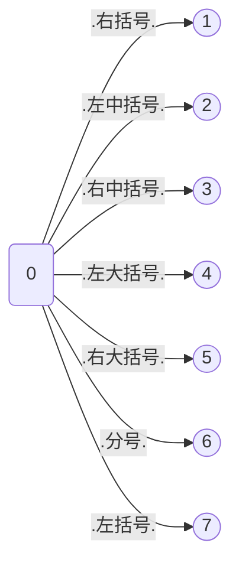

```mermaid
graph LR
id:0(0) -- .右括号. --> id:1((1))
id:0(0) -- .左中括号. --> id:2((2))
id:0(0) -- .右中括号. --> id:3((3))
id:0(0) -- .左大括号. --> id:4((4))
id:0(0) -- .右大括号. --> id:5((5))
id:0(0) -- .分号. --> id:6((6))
id:0(0) -- .左括号. --> id:7((7))
```
