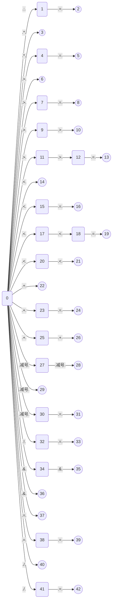

```mermaid
graph LR
id:1(1) -- .=. --> id:2((2))
id:0(0) -- .:. --> id:1(1)
id:0(0) -- .*. --> id:3((3))
id:4(4) -- .=. --> id:5((5))
id:0(0) -- .*. --> id:4(4)
id:0(0) -- .>. --> id:6((6))
id:7(7) -- .=. --> id:8((8))
id:0(0) -- .>. --> id:7(7)
id:9(9) -- .>. --> id:10((10))
id:0(0) -- .>. --> id:9(9)
id:12(12) -- .=. --> id:13((13))
id:11(11) -- .>. --> id:12(12)
id:0(0) -- .>. --> id:11(11)
id:0(0) -- .<. --> id:14((14))
id:15(15) -- .=. --> id:16((16))
id:0(0) -- .<. --> id:15(15)
id:18(18) -- .=. --> id:19((19))
id:17(17) -- .<. --> id:18(18)
id:0(0) -- .<. --> id:17(17)
id:20(20) -- .<. --> id:21((21))
id:0(0) -- .<. --> id:20(20)
id:0(0) -- .+. --> id:22((22))
id:23(23) -- .=. --> id:24((24))
id:0(0) -- .+. --> id:23(23)
id:25(25) -- .+. --> id:26((26))
id:0(0) -- .+. --> id:25(25)
id:27(27) -- .减号. --> id:28((28))
id:0(0) -- .减号. --> id:27(27)
id:0(0) -- .减号. --> id:29((29))
id:30(30) -- .=. --> id:31((31))
id:0(0) -- .减号. --> id:30(30)
id:32(32) -- .=. --> id:33((33))
id:0(0) -- .!. --> id:32(32)
id:34(34) -- .&. --> id:35((35))
id:0(0) -- .&. --> id:34(34)
id:0(0) -- .&. --> id:36((36))
id:0(0) -- .=. --> id:37((37))
id:38(38) -- .=. --> id:39((39))
id:0(0) -- .=. --> id:38(38)
id:0(0) -- ./. --> id:40((40))
id:41(41) -- .=. --> id:42((42))
id:0(0) -- ./. --> id:41(41)
```
