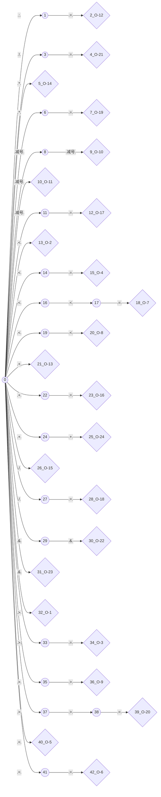

```mermaid
graph LR
id:1((1)) -- .=. --> id:2{2_O-12}
id:0((0)) -- .:. --> id:1((1))
id:3((3)) -- .=. --> id:4{4_O-21}
id:0((0)) -- .!. --> id:3((3))
id:0((0)) -- .*. --> id:5{5_O-14}
id:6((6)) -- .=. --> id:7{7_O-19}
id:0((0)) -- .*. --> id:6((6))
id:8((8)) -- .减号. --> id:9{9_O-10}
id:0((0)) -- .减号. --> id:8((8))
id:0((0)) -- .减号. --> id:10{10_O-11}
id:11((11)) -- .=. --> id:12{12_O-17}
id:0((0)) -- .减号. --> id:11((11))
id:0((0)) -- .<. --> id:13{13_O-2}
id:14((14)) -- .=. --> id:15{15_O-4}
id:0((0)) -- .<. --> id:14((14))
id:17((17)) -- .=. --> id:18{18_O-7}
id:16((16)) -- .<. --> id:17((17))
id:0((0)) -- .<. --> id:16((16))
id:19((19)) -- .<. --> id:20{20_O-8}
id:0((0)) -- .<. --> id:19((19))
id:0((0)) -- .+. --> id:21{21_O-13}
id:22((22)) -- .=. --> id:23{23_O-16}
id:0((0)) -- .+. --> id:22((22))
id:24((24)) -- .+. --> id:25{25_O-24}
id:0((0)) -- .+. --> id:24((24))
id:0((0)) -- ./. --> id:26{26_O-15}
id:27((27)) -- .=. --> id:28{28_O-18}
id:0((0)) -- ./. --> id:27((27))
id:29((29)) -- .&. --> id:30{30_O-22}
id:0((0)) -- .&. --> id:29((29))
id:0((0)) -- .&. --> id:31{31_O-23}
id:0((0)) -- .>. --> id:32{32_O-1}
id:33((33)) -- .=. --> id:34{34_O-3}
id:0((0)) -- .>. --> id:33((33))
id:35((35)) -- .>. --> id:36{36_O-9}
id:0((0)) -- .>. --> id:35((35))
id:38((38)) -- .=. --> id:39{39_O-20}
id:37((37)) -- .>. --> id:38((38))
id:0((0)) -- .>. --> id:37((37))
id:0((0)) -- .=. --> id:40{40_O-5}
id:41((41)) -- .=. --> id:42{42_O-6}
id:0((0)) -- .=. --> id:41((41))
```
