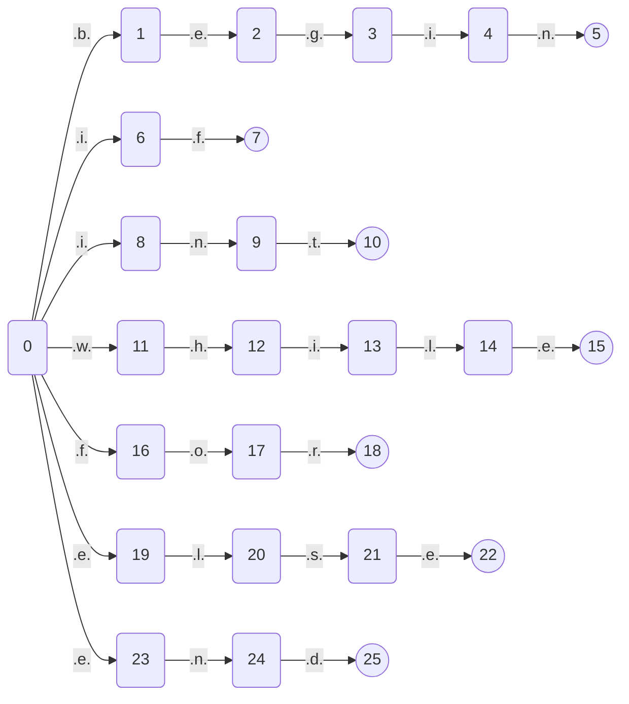

```mermaid
graph LR
id:4(4) -- .n. --> id:5((5))
id:3(3) -- .i. --> id:4(4)
id:2(2) -- .g. --> id:3(3)
id:1(1) -- .e. --> id:2(2)
id:0(0) -- .b. --> id:1(1)
id:6(6) -- .f. --> id:7((7))
id:0(0) -- .i. --> id:6(6)
id:9(9) -- .t. --> id:10((10))
id:8(8) -- .n. --> id:9(9)
id:0(0) -- .i. --> id:8(8)
id:14(14) -- .e. --> id:15((15))
id:13(13) -- .l. --> id:14(14)
id:12(12) -- .i. --> id:13(13)
id:11(11) -- .h. --> id:12(12)
id:0(0) -- .w. --> id:11(11)
id:17(17) -- .r. --> id:18((18))
id:16(16) -- .o. --> id:17(17)
id:0(0) -- .f. --> id:16(16)
id:21(21) -- .e. --> id:22((22))
id:20(20) -- .s. --> id:21(21)
id:19(19) -- .l. --> id:20(20)
id:0(0) -- .e. --> id:19(19)
id:24(24) -- .d. --> id:25((25))
id:23(23) -- .n. --> id:24(24)
id:0(0) -- .e. --> id:23(23)
```
