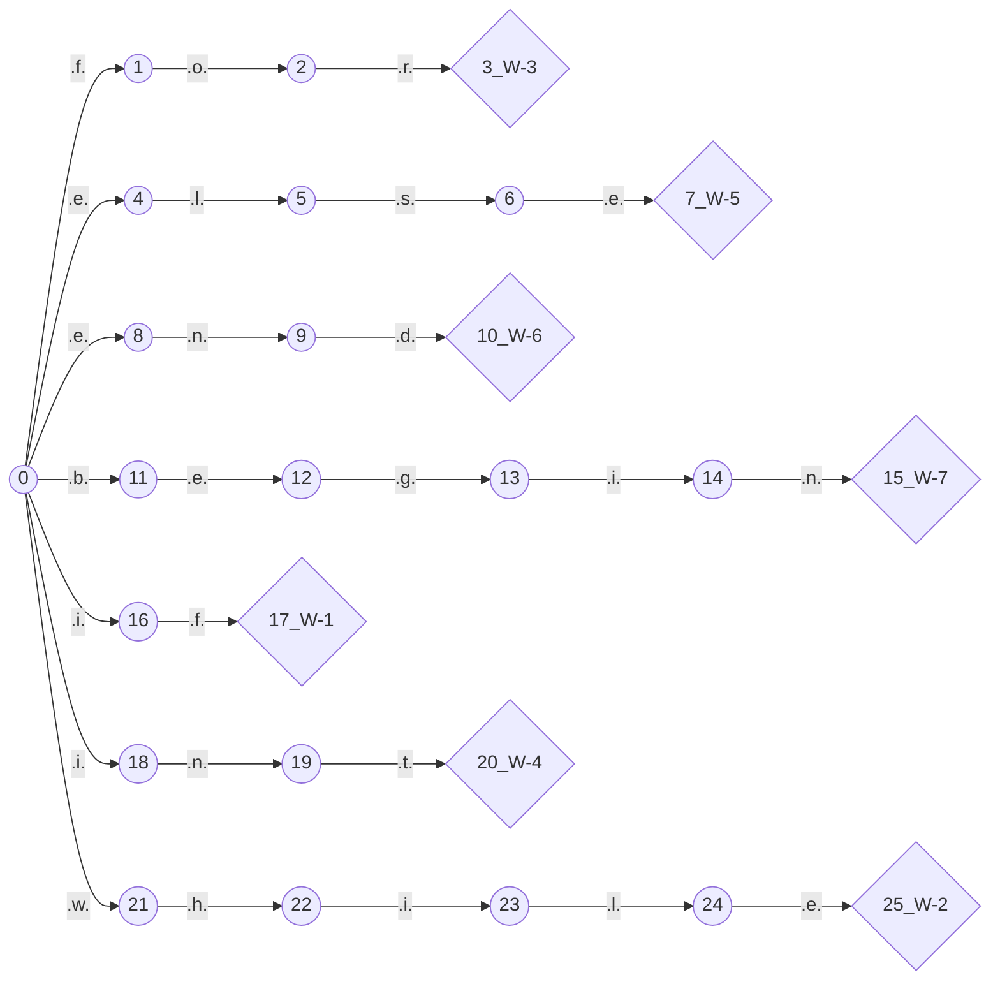

```mermaid
graph LR
id:2((2)) -- .r. --> id:3{3_W-3}
id:1((1)) -- .o. --> id:2((2))
id:0((0)) -- .f. --> id:1((1))
id:6((6)) -- .e. --> id:7{7_W-5}
id:5((5)) -- .s. --> id:6((6))
id:4((4)) -- .l. --> id:5((5))
id:0((0)) -- .e. --> id:4((4))
id:9((9)) -- .d. --> id:10{10_W-6}
id:8((8)) -- .n. --> id:9((9))
id:0((0)) -- .e. --> id:8((8))
id:14((14)) -- .n. --> id:15{15_W-7}
id:13((13)) -- .i. --> id:14((14))
id:12((12)) -- .g. --> id:13((13))
id:11((11)) -- .e. --> id:12((12))
id:0((0)) -- .b. --> id:11((11))
id:16((16)) -- .f. --> id:17{17_W-1}
id:0((0)) -- .i. --> id:16((16))
id:19((19)) -- .t. --> id:20{20_W-4}
id:18((18)) -- .n. --> id:19((19))
id:0((0)) -- .i. --> id:18((18))
id:24((24)) -- .e. --> id:25{25_W-2}
id:23((23)) -- .l. --> id:24((24))
id:22((22)) -- .i. --> id:23((23))
id:21((21)) -- .h. --> id:22((22))
id:0((0)) -- .w. --> id:21((21))
```
