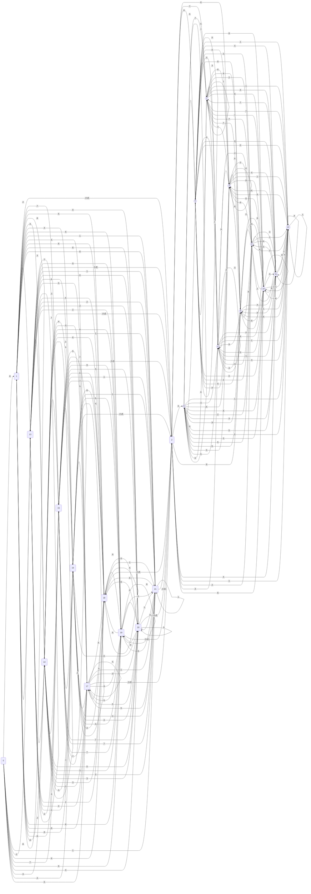

```mermaid
graph LR
id:6((6)) -- .0. --> id:5((5))
id:7((7)) -- .3. --> id:4((4))
id:7((7)) -- .5. --> id:6((6))
id:7((7)) -- .6. --> id:3((3))
id:10((10)) -- .8. --> id:10((10))
id:10((10)) -- .3. --> id:4((4))
id:11((11)) -- .8. --> id:10((10))
id:11((11)) -- .9. --> id:8((8))
id:11((11)) -- .2. --> id:9((9))
id:11((11)) -- .6. --> id:3((3))
id:11((11)) -- .7. --> id:7((7))
id:11((11)) -- .0. --> id:5((5))
id:11((11)) -- .3. --> id:4((4))
id:11((11)) -- .5. --> id:6((6))
id:12((12)) -- .6. --> id:3((3))
id:12((12)) -- .5. --> id:6((6))
id:12((12)) -- .2. --> id:9((9))
id:12((12)) -- .1. --> id:12((12))
id:12((12)) -- .3. --> id:4((4))
id:12((12)) -- .8. --> id:10((10))
id:12((12)) -- .4. --> id:11((11))
id:12((12)) -- .7. --> id:7((7))
id:12((12)) -- .9. --> id:8((8))
id:12((12)) -- .0. --> id:5((5))
id:11((11)) -- .1. --> id:12((12))
id:11((11)) -- .4. --> id:11((11))
id:10((10)) -- .4. --> id:11((11))
id:10((10)) -- .7. --> id:7((7))
id:10((10)) -- .1. --> id:12((12))
id:10((10)) -- .5. --> id:6((6))
id:10((10)) -- .0. --> id:5((5))
id:10((10)) -- .2. --> id:9((9))
id:10((10)) -- .6. --> id:3((3))
id:10((10)) -- .9. --> id:8((8))
id:9((9)) -- .8. --> id:10((10))
id:9((9)) -- .0. --> id:5((5))
id:9((9)) -- .2. --> id:9((9))
id:9((9)) -- .5. --> id:6((6))
id:9((9)) -- .9. --> id:8((8))
id:9((9)) -- .1. --> id:12((12))
id:9((9)) -- .4. --> id:11((11))
id:9((9)) -- .6. --> id:3((3))
id:9((9)) -- .7. --> id:7((7))
id:9((9)) -- .3. --> id:4((4))
id:8((8)) -- .2. --> id:9((9))
id:8((8)) -- .3. --> id:4((4))
id:8((8)) -- .7. --> id:7((7))
id:8((8)) -- .0. --> id:5((5))
id:8((8)) -- .9. --> id:8((8))
id:8((8)) -- .8. --> id:10((10))
id:8((8)) -- .4. --> id:11((11))
id:8((8)) -- .5. --> id:6((6))
id:8((8)) -- .6. --> id:3((3))
id:8((8)) -- .1. --> id:12((12))
id:7((7)) -- .9. --> id:8((8))
id:7((7)) -- .2. --> id:9((9))
id:7((7)) -- .7. --> id:7((7))
id:7((7)) -- .0. --> id:5((5))
id:7((7)) -- .1. --> id:12((12))
id:7((7)) -- .4. --> id:11((11))
id:7((7)) -- .8. --> id:10((10))
id:6((6)) -- .7. --> id:7((7))
id:6((6)) -- .5. --> id:6((6))
id:6((6)) -- .1. --> id:12((12))
id:6((6)) -- .3. --> id:4((4))
id:6((6)) -- .6. --> id:3((3))
id:6((6)) -- .8. --> id:10((10))
id:6((6)) -- .2. --> id:9((9))
id:6((6)) -- .4. --> id:11((11))
id:6((6)) -- .9. --> id:8((8))
id:5((5)) -- .5. --> id:6((6))
id:5((5)) -- .7. --> id:7((7))
id:5((5)) -- .8. --> id:10((10))
id:5((5)) -- .0. --> id:5((5))
id:5((5)) -- .1. --> id:12((12))
id:5((5)) -- .4. --> id:11((11))
id:5((5)) -- .6. --> id:3((3))
id:5((5)) -- .2. --> id:9((9))
id:5((5)) -- .3. --> id:4((4))
id:5((5)) -- .9. --> id:8((8))
id:4((4)) -- .0. --> id:5((5))
id:4((4)) -- .6. --> id:3((3))
id:4((4)) -- .2. --> id:9((9))
id:4((4)) -- .5. --> id:6((6))
id:4((4)) -- .3. --> id:4((4))
id:4((4)) -- .4. --> id:11((11))
id:4((4)) -- .8. --> id:10((10))
id:4((4)) -- .1. --> id:12((12))
id:4((4)) -- .7. --> id:7((7))
id:4((4)) -- .9. --> id:8((8))
id:3((3)) -- .3. --> id:4((4))
id:3((3)) -- .9. --> id:8((8))
id:3((3)) -- .2. --> id:9((9))
id:3((3)) -- .6. --> id:3((3))
id:3((3)) -- .0. --> id:5((5))
id:3((3)) -- .4. --> id:11((11))
id:3((3)) -- .5. --> id:6((6))
id:3((3)) -- .1. --> id:12((12))
id:3((3)) -- .7. --> id:7((7))
id:3((3)) -- .8. --> id:10((10))
id:2(2) -- .6. --> id:3((3))
id:2(2) -- .7. --> id:7((7))
id:2(2) -- .0. --> id:5((5))
id:2(2) -- .5. --> id:6((6))
id:2(2) -- .9. --> id:8((8))
id:2(2) -- .4. --> id:11((11))
id:2(2) -- .1. --> id:12((12))
id:2(2) -- .2. --> id:9((9))
id:2(2) -- .3. --> id:4((4))
id:2(2) -- .8. --> id:10((10))
id:1(1) -- .小点. --> id:2(2)
id:14(14) -- .小点. --> id:2(2)
id:17(17) -- .5. --> id:17(17)
id:18(18) -- .7. --> id:15(15)
id:18(18) -- .8. --> id:1(1)
id:19(19) -- .5. --> id:17(17)
id:19(19) -- .9. --> id:19(19)
id:19(19) -- .3. --> id:14(14)
id:20(20) -- .5. --> id:17(17)
id:20(20) -- .7. --> id:15(15)
id:20(20) -- .8. --> id:1(1)
id:20(20) -- .9. --> id:19(19)
id:21(21) -- .5. --> id:17(17)
id:21(21) -- .0. --> id:20(20)
id:21(21) -- .1. --> id:21(21)
id:21(21) -- .2. --> id:13(13)
id:21(21) -- .6. --> id:18(18)
id:21(21) -- .4. --> id:16(16)
id:21(21) -- .小点. --> id:2(2)
id:21(21) -- .7. --> id:15(15)
id:21(21) -- .3. --> id:14(14)
id:21(21) -- .8. --> id:1(1)
id:21(21) -- .9. --> id:19(19)
id:20(20) -- .1. --> id:21(21)
id:20(20) -- .小点. --> id:2(2)
id:20(20) -- .3. --> id:14(14)
id:20(20) -- .4. --> id:16(16)
id:20(20) -- .0. --> id:20(20)
id:20(20) -- .2. --> id:13(13)
id:20(20) -- .6. --> id:18(18)
id:19(19) -- .0. --> id:20(20)
id:19(19) -- .1. --> id:21(21)
id:19(19) -- .小点. --> id:2(2)
id:19(19) -- .6. --> id:18(18)
id:19(19) -- .8. --> id:1(1)
id:19(19) -- .2. --> id:13(13)
id:19(19) -- .7. --> id:15(15)
id:19(19) -- .4. --> id:16(16)
id:18(18) -- .9. --> id:19(19)
id:18(18) -- .0. --> id:20(20)
id:18(18) -- .4. --> id:16(16)
id:18(18) -- .1. --> id:21(21)
id:18(18) -- .5. --> id:17(17)
id:18(18) -- .6. --> id:18(18)
id:18(18) -- .小点. --> id:2(2)
id:18(18) -- .2. --> id:13(13)
id:18(18) -- .3. --> id:14(14)
id:17(17) -- .6. --> id:18(18)
id:17(17) -- .1. --> id:21(21)
id:17(17) -- .2. --> id:13(13)
id:17(17) -- .3. --> id:14(14)
id:17(17) -- .0. --> id:20(20)
id:17(17) -- .小点. --> id:2(2)
id:17(17) -- .7. --> id:15(15)
id:17(17) -- .8. --> id:1(1)
id:17(17) -- .4. --> id:16(16)
id:17(17) -- .9. --> id:19(19)
id:16(16) -- .5. --> id:17(17)
id:16(16) -- .6. --> id:18(18)
id:16(16) -- .1. --> id:21(21)
id:16(16) -- .3. --> id:14(14)
id:16(16) -- .9. --> id:19(19)
id:16(16) -- .2. --> id:13(13)
id:16(16) -- .4. --> id:16(16)
id:16(16) -- .小点. --> id:2(2)
id:16(16) -- .0. --> id:20(20)
id:16(16) -- .8. --> id:1(1)
id:16(16) -- .7. --> id:15(15)
id:15(15) -- .4. --> id:16(16)
id:15(15) -- .5. --> id:17(17)
id:15(15) -- .7. --> id:15(15)
id:15(15) -- .小点. --> id:2(2)
id:15(15) -- .3. --> id:14(14)
id:15(15) -- .8. --> id:1(1)
id:15(15) -- .9. --> id:19(19)
id:15(15) -- .0. --> id:20(20)
id:15(15) -- .6. --> id:18(18)
id:15(15) -- .2. --> id:13(13)
id:15(15) -- .1. --> id:21(21)
id:14(14) -- .7. --> id:15(15)
id:14(14) -- .8. --> id:1(1)
id:14(14) -- .4. --> id:16(16)
id:14(14) -- .5. --> id:17(17)
id:14(14) -- .9. --> id:19(19)
id:14(14) -- .1. --> id:21(21)
id:14(14) -- .2. --> id:13(13)
id:14(14) -- .6. --> id:18(18)
id:14(14) -- .3. --> id:14(14)
id:14(14) -- .0. --> id:20(20)
id:13(13) -- .3. --> id:14(14)
id:13(13) -- .7. --> id:15(15)
id:13(13) -- .9. --> id:19(19)
id:13(13) -- .小点. --> id:2(2)
id:13(13) -- .1. --> id:21(21)
id:13(13) -- .0. --> id:20(20)
id:13(13) -- .4. --> id:16(16)
id:13(13) -- .5. --> id:17(17)
id:13(13) -- .2. --> id:13(13)
id:13(13) -- .6. --> id:18(18)
id:13(13) -- .8. --> id:1(1)
id:1(1) -- .2. --> id:13(13)
id:1(1) -- .7. --> id:15(15)
id:1(1) -- .0. --> id:20(20)
id:1(1) -- .6. --> id:18(18)
id:1(1) -- .8. --> id:1(1)
id:1(1) -- .3. --> id:14(14)
id:1(1) -- .4. --> id:16(16)
id:1(1) -- .9. --> id:19(19)
id:1(1) -- .1. --> id:21(21)
id:1(1) -- .5. --> id:17(17)
id:0(0) -- .8. --> id:1(1)
id:0(0) -- .1. --> id:21(21)
id:0(0) -- .2. --> id:13(13)
id:0(0) -- .6. --> id:18(18)
id:0(0) -- .7. --> id:15(15)
id:0(0) -- .9. --> id:19(19)
id:0(0) -- .0. --> id:20(20)
id:0(0) -- .3. --> id:14(14)
id:0(0) -- .4. --> id:16(16)
id:0(0) -- .5. --> id:17(17)
```
