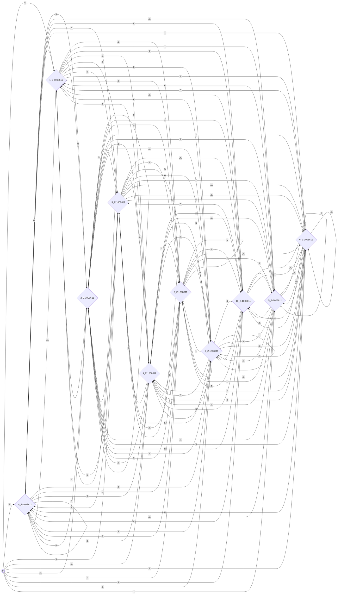

```mermaid
graph LR
id:4{4_Z-1008611} -- .6. --> id:1{1_Z-1008611}
id:4{4_Z-1008611} -- .9. --> id:2{2_Z-1008611}
id:5{5_Z-1008611} -- .9. --> id:2{2_Z-1008611}
id:5{5_Z-1008611} -- .6. --> id:1{1_Z-1008611}
id:8{8_Z-1008611} -- .1. --> id:8{8_Z-1008611}
id:8{8_Z-1008611} -- .6. --> id:1{1_Z-1008611}
id:8{8_Z-1008611} -- .0. --> id:7{7_Z-1008611}
id:8{8_Z-1008611} -- .8. --> id:4{4_Z-1008611}
id:9{9_Z-1008611} -- .1. --> id:8{8_Z-1008611}
id:10{10_Z-1008611} -- .2. --> id:5{5_Z-1008611}
id:10{10_Z-1008611} -- .3. --> id:9{9_Z-1008611}
id:10{10_Z-1008611} -- .6. --> id:1{1_Z-1008611}
id:10{10_Z-1008611} -- .8. --> id:4{4_Z-1008611}
id:10{10_Z-1008611} -- .9. --> id:2{2_Z-1008611}
id:10{10_Z-1008611} -- .1. --> id:8{8_Z-1008611}
id:10{10_Z-1008611} -- .4. --> id:10{10_Z-1008611}
id:10{10_Z-1008611} -- .0. --> id:7{7_Z-1008611}
id:10{10_Z-1008611} -- .5. --> id:3{3_Z-1008611}
id:10{10_Z-1008611} -- .7. --> id:6{6_Z-1008611}
id:9{9_Z-1008611} -- .4. --> id:10{10_Z-1008611}
id:9{9_Z-1008611} -- .9. --> id:2{2_Z-1008611}
id:9{9_Z-1008611} -- .8. --> id:4{4_Z-1008611}
id:9{9_Z-1008611} -- .2. --> id:5{5_Z-1008611}
id:9{9_Z-1008611} -- .3. --> id:9{9_Z-1008611}
id:9{9_Z-1008611} -- .0. --> id:7{7_Z-1008611}
id:9{9_Z-1008611} -- .5. --> id:3{3_Z-1008611}
id:9{9_Z-1008611} -- .6. --> id:1{1_Z-1008611}
id:9{9_Z-1008611} -- .7. --> id:6{6_Z-1008611}
id:8{8_Z-1008611} -- .3. --> id:9{9_Z-1008611}
id:8{8_Z-1008611} -- .4. --> id:10{10_Z-1008611}
id:8{8_Z-1008611} -- .5. --> id:3{3_Z-1008611}
id:8{8_Z-1008611} -- .7. --> id:6{6_Z-1008611}
id:8{8_Z-1008611} -- .9. --> id:2{2_Z-1008611}
id:8{8_Z-1008611} -- .2. --> id:5{5_Z-1008611}
id:7{7_Z-1008611} -- .1. --> id:8{8_Z-1008611}
id:7{7_Z-1008611} -- .3. --> id:9{9_Z-1008611}
id:7{7_Z-1008611} -- .4. --> id:10{10_Z-1008611}
id:7{7_Z-1008611} -- .5. --> id:3{3_Z-1008611}
id:7{7_Z-1008611} -- .6. --> id:1{1_Z-1008611}
id:7{7_Z-1008611} -- .0. --> id:7{7_Z-1008611}
id:7{7_Z-1008611} -- .2. --> id:5{5_Z-1008611}
id:7{7_Z-1008611} -- .7. --> id:6{6_Z-1008611}
id:7{7_Z-1008611} -- .8. --> id:4{4_Z-1008611}
id:7{7_Z-1008611} -- .9. --> id:2{2_Z-1008611}
id:6{6_Z-1008611} -- .0. --> id:7{7_Z-1008611}
id:6{6_Z-1008611} -- .4. --> id:10{10_Z-1008611}
id:6{6_Z-1008611} -- .6. --> id:1{1_Z-1008611}
id:6{6_Z-1008611} -- .8. --> id:4{4_Z-1008611}
id:6{6_Z-1008611} -- .9. --> id:2{2_Z-1008611}
id:6{6_Z-1008611} -- .3. --> id:9{9_Z-1008611}
id:6{6_Z-1008611} -- .5. --> id:3{3_Z-1008611}
id:6{6_Z-1008611} -- .7. --> id:6{6_Z-1008611}
id:6{6_Z-1008611} -- .1. --> id:8{8_Z-1008611}
id:6{6_Z-1008611} -- .2. --> id:5{5_Z-1008611}
id:5{5_Z-1008611} -- .7. --> id:6{6_Z-1008611}
id:5{5_Z-1008611} -- .8. --> id:4{4_Z-1008611}
id:5{5_Z-1008611} -- .1. --> id:8{8_Z-1008611}
id:5{5_Z-1008611} -- .4. --> id:10{10_Z-1008611}
id:5{5_Z-1008611} -- .3. --> id:9{9_Z-1008611}
id:5{5_Z-1008611} -- .5. --> id:3{3_Z-1008611}
id:5{5_Z-1008611} -- .0. --> id:7{7_Z-1008611}
id:5{5_Z-1008611} -- .2. --> id:5{5_Z-1008611}
id:4{4_Z-1008611} -- .2. --> id:5{5_Z-1008611}
id:4{4_Z-1008611} -- .4. --> id:10{10_Z-1008611}
id:4{4_Z-1008611} -- .5. --> id:3{3_Z-1008611}
id:4{4_Z-1008611} -- .7. --> id:6{6_Z-1008611}
id:4{4_Z-1008611} -- .0. --> id:7{7_Z-1008611}
id:4{4_Z-1008611} -- .1. --> id:8{8_Z-1008611}
id:4{4_Z-1008611} -- .3. --> id:9{9_Z-1008611}
id:4{4_Z-1008611} -- .8. --> id:4{4_Z-1008611}
id:3{3_Z-1008611} -- .8. --> id:4{4_Z-1008611}
id:3{3_Z-1008611} -- .3. --> id:9{9_Z-1008611}
id:3{3_Z-1008611} -- .4. --> id:10{10_Z-1008611}
id:3{3_Z-1008611} -- .6. --> id:1{1_Z-1008611}
id:3{3_Z-1008611} -- .1. --> id:8{8_Z-1008611}
id:3{3_Z-1008611} -- .5. --> id:3{3_Z-1008611}
id:3{3_Z-1008611} -- .0. --> id:7{7_Z-1008611}
id:3{3_Z-1008611} -- .9. --> id:2{2_Z-1008611}
id:3{3_Z-1008611} -- .2. --> id:5{5_Z-1008611}
id:3{3_Z-1008611} -- .7. --> id:6{6_Z-1008611}
id:2{2_Z-1008611} -- .5. --> id:3{3_Z-1008611}
id:2{2_Z-1008611} -- .9. --> id:2{2_Z-1008611}
id:2{2_Z-1008611} -- .8. --> id:4{4_Z-1008611}
id:2{2_Z-1008611} -- .4. --> id:10{10_Z-1008611}
id:2{2_Z-1008611} -- .1. --> id:8{8_Z-1008611}
id:2{2_Z-1008611} -- .7. --> id:6{6_Z-1008611}
id:2{2_Z-1008611} -- .2. --> id:5{5_Z-1008611}
id:2{2_Z-1008611} -- .3. --> id:9{9_Z-1008611}
id:2{2_Z-1008611} -- .6. --> id:1{1_Z-1008611}
id:2{2_Z-1008611} -- .0. --> id:7{7_Z-1008611}
id:1{1_Z-1008611} -- .9. --> id:2{2_Z-1008611}
id:1{1_Z-1008611} -- .1. --> id:8{8_Z-1008611}
id:1{1_Z-1008611} -- .2. --> id:5{5_Z-1008611}
id:1{1_Z-1008611} -- .4. --> id:10{10_Z-1008611}
id:1{1_Z-1008611} -- .8. --> id:4{4_Z-1008611}
id:1{1_Z-1008611} -- .3. --> id:9{9_Z-1008611}
id:1{1_Z-1008611} -- .6. --> id:1{1_Z-1008611}
id:1{1_Z-1008611} -- .0. --> id:7{7_Z-1008611}
id:1{1_Z-1008611} -- .5. --> id:3{3_Z-1008611}
id:1{1_Z-1008611} -- .7. --> id:6{6_Z-1008611}
id:0((0)) -- .6. --> id:1{1_Z-1008611}
id:0((0)) -- .8. --> id:4{4_Z-1008611}
id:0((0)) -- .5. --> id:3{3_Z-1008611}
id:0((0)) -- .3. --> id:9{9_Z-1008611}
id:0((0)) -- .7. --> id:6{6_Z-1008611}
id:0((0)) -- .9. --> id:2{2_Z-1008611}
id:0((0)) -- .1. --> id:8{8_Z-1008611}
id:0((0)) -- .4. --> id:10{10_Z-1008611}
id:0((0)) -- .0. --> id:7{7_Z-1008611}
id:0((0)) -- .2. --> id:5{5_Z-1008611}
```
