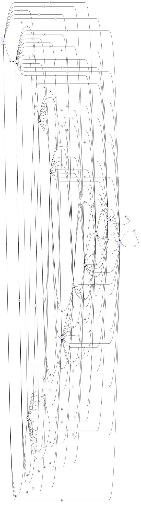

```mermaid
graph LR
id:5((5)) -- .2. --> id:2((2))
id:5((5)) -- .4. --> id:3((3))
id:6((6)) -- .7. --> id:6((6))
id:6((6)) -- .4. --> id:3((3))
id:6((6)) -- .6. --> id:5((5))
id:6((6)) -- .8. --> id:4((4))
id:8((8)) -- .4. --> id:3((3))
id:8((8)) -- .9. --> id:7((7))
id:8((8)) -- .1. --> id:8((8))
id:9((9)) -- .3. --> id:9((9))
id:9((9)) -- .4. --> id:3((3))
id:9((9)) -- .8. --> id:4((4))
id:9((9)) -- .0. --> id:1((1))
id:9((9)) -- .2. --> id:2((2))
id:9((9)) -- .7. --> id:6((6))
id:9((9)) -- .9. --> id:7((7))
id:10((10)) -- .1. --> id:8((8))
id:10((10)) -- .2. --> id:2((2))
id:10((10)) -- .6. --> id:5((5))
id:10((10)) -- .7. --> id:6((6))
id:10((10)) -- .8. --> id:4((4))
id:10((10)) -- .3. --> id:9((9))
id:10((10)) -- .4. --> id:3((3))
id:10((10)) -- .9. --> id:7((7))
id:10((10)) -- .0. --> id:1((1))
id:10((10)) -- .5. --> id:10((10))
id:9((9)) -- .5. --> id:10((10))
id:9((9)) -- .6. --> id:5((5))
id:9((9)) -- .1. --> id:8((8))
id:8((8)) -- .3. --> id:9((9))
id:8((8)) -- .5. --> id:10((10))
id:8((8)) -- .0. --> id:1((1))
id:8((8)) -- .2. --> id:2((2))
id:8((8)) -- .6. --> id:5((5))
id:8((8)) -- .7. --> id:6((6))
id:8((8)) -- .8. --> id:4((4))
id:7((7)) -- .1. --> id:8((8))
id:7((7)) -- .4. --> id:3((3))
id:7((7)) -- .5. --> id:10((10))
id:7((7)) -- .0. --> id:1((1))
id:7((7)) -- .8. --> id:4((4))
id:7((7)) -- .6. --> id:5((5))
id:7((7)) -- .2. --> id:2((2))
id:7((7)) -- .3. --> id:9((9))
id:7((7)) -- .7. --> id:6((6))
id:7((7)) -- .9. --> id:7((7))
id:6((6)) -- .9. --> id:7((7))
id:6((6)) -- .0. --> id:1((1))
id:6((6)) -- .2. --> id:2((2))
id:6((6)) -- .3. --> id:9((9))
id:6((6)) -- .5. --> id:10((10))
id:6((6)) -- .1. --> id:8((8))
id:5((5)) -- .7. --> id:6((6))
id:5((5)) -- .1. --> id:8((8))
id:5((5)) -- .8. --> id:4((4))
id:5((5)) -- .9. --> id:7((7))
id:5((5)) -- .3. --> id:9((9))
id:5((5)) -- .5. --> id:10((10))
id:5((5)) -- .6. --> id:5((5))
id:5((5)) -- .0. --> id:1((1))
id:4((4)) -- .6. --> id:5((5))
id:4((4)) -- .9. --> id:7((7))
id:4((4)) -- .7. --> id:6((6))
id:4((4)) -- .8. --> id:4((4))
id:4((4)) -- .2. --> id:2((2))
id:4((4)) -- .3. --> id:9((9))
id:4((4)) -- .5. --> id:10((10))
id:4((4)) -- .1. --> id:8((8))
id:4((4)) -- .4. --> id:3((3))
id:4((4)) -- .0. --> id:1((1))
id:3((3)) -- .8. --> id:4((4))
id:3((3)) -- .9. --> id:7((7))
id:3((3)) -- .4. --> id:3((3))
id:3((3)) -- .7. --> id:6((6))
id:3((3)) -- .0. --> id:1((1))
id:3((3)) -- .3. --> id:9((9))
id:3((3)) -- .1. --> id:8((8))
id:3((3)) -- .5. --> id:10((10))
id:3((3)) -- .6. --> id:5((5))
id:3((3)) -- .2. --> id:2((2))
id:2((2)) -- .4. --> id:3((3))
id:2((2)) -- .5. --> id:10((10))
id:2((2)) -- .7. --> id:6((6))
id:2((2)) -- .1. --> id:8((8))
id:2((2)) -- .2. --> id:2((2))
id:2((2)) -- .8. --> id:4((4))
id:2((2)) -- .9. --> id:7((7))
id:2((2)) -- .0. --> id:1((1))
id:2((2)) -- .3. --> id:9((9))
id:2((2)) -- .6. --> id:5((5))
id:1((1)) -- .2. --> id:2((2))
id:1((1)) -- .4. --> id:3((3))
id:1((1)) -- .5. --> id:10((10))
id:1((1)) -- .7. --> id:6((6))
id:1((1)) -- .8. --> id:4((4))
id:1((1)) -- .1. --> id:8((8))
id:1((1)) -- .6. --> id:5((5))
id:1((1)) -- .9. --> id:7((7))
id:1((1)) -- .0. --> id:1((1))
id:1((1)) -- .3. --> id:9((9))
id:0(0) -- .0. --> id:1((1))
id:0(0) -- .3. --> id:9((9))
id:0(0) -- .4. --> id:3((3))
id:0(0) -- .1. --> id:8((8))
id:0(0) -- .5. --> id:10((10))
id:0(0) -- .6. --> id:5((5))
id:0(0) -- .9. --> id:7((7))
id:0(0) -- .8. --> id:4((4))
id:0(0) -- .2. --> id:2((2))
id:0(0) -- .7. --> id:6((6))
```
