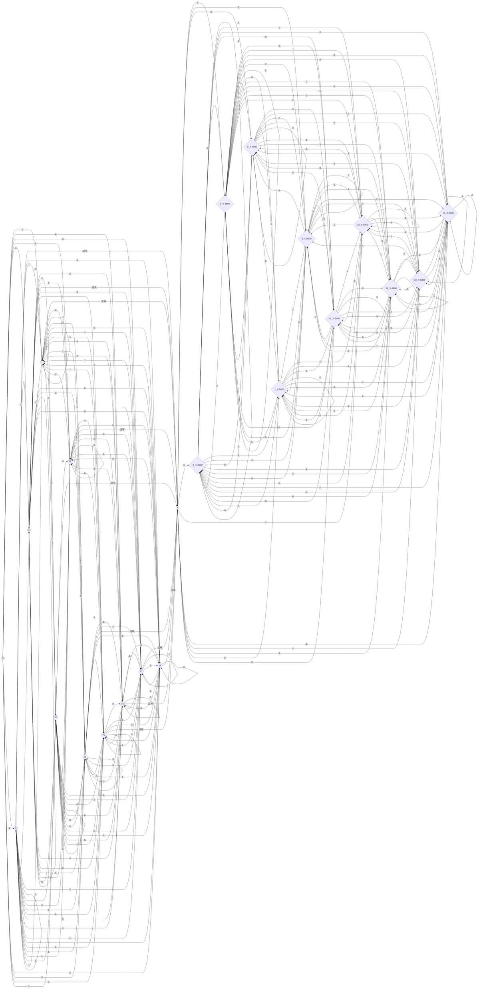

```mermaid
graph LR
id:9{9_X-8800} -- .5. --> id:5{5_X-8800}
id:9{9_X-8800} -- .0. --> id:9{9_X-8800}
id:10{10_X-8800} -- .8. --> id:6{6_X-8800}
id:10{10_X-8800} -- .7. --> id:8{8_X-8800}
id:10{10_X-8800} -- .0. --> id:9{9_X-8800}
id:10{10_X-8800} -- .1. --> id:10{10_X-8800}
id:11{11_X-8800} -- .1. --> id:10{10_X-8800}
id:11{11_X-8800} -- .0. --> id:9{9_X-8800}
id:11{11_X-8800} -- .5. --> id:5{5_X-8800}
id:13{13_X-8800} -- .4. --> id:13{13_X-8800}
id:13{13_X-8800} -- .7. --> id:8{8_X-8800}
id:13{13_X-8800} -- .3. --> id:12{12_X-8800}
id:14{14_X-8800} -- .0. --> id:9{9_X-8800}
id:14{14_X-8800} -- .4. --> id:13{13_X-8800}
id:14{14_X-8800} -- .6. --> id:7{7_X-8800}
id:14{14_X-8800} -- .5. --> id:5{5_X-8800}
id:14{14_X-8800} -- .7. --> id:8{8_X-8800}
id:14{14_X-8800} -- .8. --> id:6{6_X-8800}
id:14{14_X-8800} -- .9. --> id:11{11_X-8800}
id:14{14_X-8800} -- .1. --> id:10{10_X-8800}
id:14{14_X-8800} -- .2. --> id:14{14_X-8800}
id:14{14_X-8800} -- .3. --> id:12{12_X-8800}
id:13{13_X-8800} -- .2. --> id:14{14_X-8800}
id:13{13_X-8800} -- .8. --> id:6{6_X-8800}
id:13{13_X-8800} -- .0. --> id:9{9_X-8800}
id:13{13_X-8800} -- .5. --> id:5{5_X-8800}
id:13{13_X-8800} -- .9. --> id:11{11_X-8800}
id:13{13_X-8800} -- .1. --> id:10{10_X-8800}
id:13{13_X-8800} -- .6. --> id:7{7_X-8800}
id:12{12_X-8800} -- .4. --> id:13{13_X-8800}
id:12{12_X-8800} -- .6. --> id:7{7_X-8800}
id:12{12_X-8800} -- .2. --> id:14{14_X-8800}
id:12{12_X-8800} -- .3. --> id:12{12_X-8800}
id:12{12_X-8800} -- .5. --> id:5{5_X-8800}
id:12{12_X-8800} -- .7. --> id:8{8_X-8800}
id:12{12_X-8800} -- .0. --> id:9{9_X-8800}
id:12{12_X-8800} -- .8. --> id:6{6_X-8800}
id:12{12_X-8800} -- .9. --> id:11{11_X-8800}
id:12{12_X-8800} -- .1. --> id:10{10_X-8800}
id:11{11_X-8800} -- .3. --> id:12{12_X-8800}
id:11{11_X-8800} -- .9. --> id:11{11_X-8800}
id:11{11_X-8800} -- .7. --> id:8{8_X-8800}
id:11{11_X-8800} -- .8. --> id:6{6_X-8800}
id:11{11_X-8800} -- .2. --> id:14{14_X-8800}
id:11{11_X-8800} -- .4. --> id:13{13_X-8800}
id:11{11_X-8800} -- .6. --> id:7{7_X-8800}
id:10{10_X-8800} -- .9. --> id:11{11_X-8800}
id:10{10_X-8800} -- .3. --> id:12{12_X-8800}
id:10{10_X-8800} -- .2. --> id:14{14_X-8800}
id:10{10_X-8800} -- .4. --> id:13{13_X-8800}
id:10{10_X-8800} -- .5. --> id:5{5_X-8800}
id:10{10_X-8800} -- .6. --> id:7{7_X-8800}
id:9{9_X-8800} -- .1. --> id:10{10_X-8800}
id:9{9_X-8800} -- .2. --> id:14{14_X-8800}
id:9{9_X-8800} -- .9. --> id:11{11_X-8800}
id:9{9_X-8800} -- .6. --> id:7{7_X-8800}
id:9{9_X-8800} -- .7. --> id:8{8_X-8800}
id:9{9_X-8800} -- .8. --> id:6{6_X-8800}
id:9{9_X-8800} -- .4. --> id:13{13_X-8800}
id:9{9_X-8800} -- .3. --> id:12{12_X-8800}
id:8{8_X-8800} -- .0. --> id:9{9_X-8800}
id:8{8_X-8800} -- .6. --> id:7{7_X-8800}
id:8{8_X-8800} -- .7. --> id:8{8_X-8800}
id:8{8_X-8800} -- .9. --> id:11{11_X-8800}
id:8{8_X-8800} -- .1. --> id:10{10_X-8800}
id:8{8_X-8800} -- .3. --> id:12{12_X-8800}
id:8{8_X-8800} -- .8. --> id:6{6_X-8800}
id:8{8_X-8800} -- .2. --> id:14{14_X-8800}
id:8{8_X-8800} -- .4. --> id:13{13_X-8800}
id:8{8_X-8800} -- .5. --> id:5{5_X-8800}
id:7{7_X-8800} -- .7. --> id:8{8_X-8800}
id:7{7_X-8800} -- .0. --> id:9{9_X-8800}
id:7{7_X-8800} -- .1. --> id:10{10_X-8800}
id:7{7_X-8800} -- .4. --> id:13{13_X-8800}
id:7{7_X-8800} -- .9. --> id:11{11_X-8800}
id:7{7_X-8800} -- .6. --> id:7{7_X-8800}
id:7{7_X-8800} -- .2. --> id:14{14_X-8800}
id:7{7_X-8800} -- .3. --> id:12{12_X-8800}
id:7{7_X-8800} -- .5. --> id:5{5_X-8800}
id:7{7_X-8800} -- .8. --> id:6{6_X-8800}
id:6{6_X-8800} -- .6. --> id:7{7_X-8800}
id:6{6_X-8800} -- .0. --> id:9{9_X-8800}
id:6{6_X-8800} -- .9. --> id:11{11_X-8800}
id:6{6_X-8800} -- .2. --> id:14{14_X-8800}
id:6{6_X-8800} -- .5. --> id:5{5_X-8800}
id:6{6_X-8800} -- .7. --> id:8{8_X-8800}
id:6{6_X-8800} -- .4. --> id:13{13_X-8800}
id:6{6_X-8800} -- .8. --> id:6{6_X-8800}
id:6{6_X-8800} -- .1. --> id:10{10_X-8800}
id:6{6_X-8800} -- .3. --> id:12{12_X-8800}
id:5{5_X-8800} -- .8. --> id:6{6_X-8800}
id:5{5_X-8800} -- .9. --> id:11{11_X-8800}
id:5{5_X-8800} -- .1. --> id:10{10_X-8800}
id:5{5_X-8800} -- .2. --> id:14{14_X-8800}
id:5{5_X-8800} -- .4. --> id:13{13_X-8800}
id:5{5_X-8800} -- .7. --> id:8{8_X-8800}
id:5{5_X-8800} -- .0. --> id:9{9_X-8800}
id:5{5_X-8800} -- .5. --> id:5{5_X-8800}
id:5{5_X-8800} -- .6. --> id:7{7_X-8800}
id:5{5_X-8800} -- .3. --> id:12{12_X-8800}
id:4((4)) -- .5. --> id:5{5_X-8800}
id:4((4)) -- .7. --> id:8{8_X-8800}
id:4((4)) -- .8. --> id:6{6_X-8800}
id:4((4)) -- .0. --> id:9{9_X-8800}
id:4((4)) -- .1. --> id:10{10_X-8800}
id:4((4)) -- .2. --> id:14{14_X-8800}
id:4((4)) -- .4. --> id:13{13_X-8800}
id:4((4)) -- .3. --> id:12{12_X-8800}
id:4((4)) -- .6. --> id:7{7_X-8800}
id:4((4)) -- .9. --> id:11{11_X-8800}
id:3((3)) -- .逗号. --> id:4((4))
id:3((3)) -- .0. --> id:2((2))
id:15((15)) -- .6. --> id:15((15))
id:16((16)) -- .7. --> id:1((1))
id:16((16)) -- .1. --> id:3((3))
id:17((17)) -- .0. --> id:2((2))
id:17((17)) -- .逗号. --> id:4((4))
id:17((17)) -- .2. --> id:17((17))
id:17((17)) -- .7. --> id:1((1))
id:19((19)) -- .9. --> id:18((18))
id:20((20)) -- .9. --> id:18((18))
id:20((20)) -- .1. --> id:3((3))
id:20((20)) -- .0. --> id:2((2))
id:20((20)) -- .7. --> id:1((1))
id:20((20)) -- .逗号. --> id:4((4))
id:20((20)) -- .6. --> id:15((15))
id:20((20)) -- .2. --> id:17((17))
id:21((21)) -- .8. --> id:16((16))
id:21((21)) -- .2. --> id:17((17))
id:21((21)) -- .6. --> id:15((15))
id:21((21)) -- .1. --> id:3((3))
id:21((21)) -- .逗号. --> id:4((4))
id:21((21)) -- .4. --> id:21((21))
id:21((21)) -- .5. --> id:20((20))
id:21((21)) -- .7. --> id:1((1))
id:21((21)) -- .9. --> id:18((18))
id:21((21)) -- .0. --> id:2((2))
id:21((21)) -- .3. --> id:19((19))
id:20((20)) -- .4. --> id:21((21))
id:20((20)) -- .5. --> id:20((20))
id:20((20)) -- .8. --> id:16((16))
id:20((20)) -- .3. --> id:19((19))
id:19((19)) -- .5. --> id:20((20))
id:19((19)) -- .7. --> id:1((1))
id:19((19)) -- .4. --> id:21((21))
id:19((19)) -- .8. --> id:16((16))
id:19((19)) -- .0. --> id:2((2))
id:19((19)) -- .2. --> id:17((17))
id:19((19)) -- .逗号. --> id:4((4))
id:19((19)) -- .1. --> id:3((3))
id:19((19)) -- .6. --> id:15((15))
id:19((19)) -- .3. --> id:19((19))
id:18((18)) -- .3. --> id:19((19))
id:18((18)) -- .4. --> id:21((21))
id:18((18)) -- .5. --> id:20((20))
id:18((18)) -- .0. --> id:2((2))
id:18((18)) -- .6. --> id:15((15))
id:18((18)) -- .逗号. --> id:4((4))
id:18((18)) -- .2. --> id:17((17))
id:18((18)) -- .8. --> id:16((16))
id:18((18)) -- .9. --> id:18((18))
id:18((18)) -- .1. --> id:3((3))
id:18((18)) -- .7. --> id:1((1))
id:17((17)) -- .9. --> id:18((18))
id:17((17)) -- .1. --> id:3((3))
id:17((17)) -- .3. --> id:19((19))
id:17((17)) -- .5. --> id:20((20))
id:17((17)) -- .6. --> id:15((15))
id:17((17)) -- .8. --> id:16((16))
id:17((17)) -- .4. --> id:21((21))
id:16((16)) -- .2. --> id:17((17))
id:16((16)) -- .3. --> id:19((19))
id:16((16)) -- .6. --> id:15((15))
id:16((16)) -- .0. --> id:2((2))
id:16((16)) -- .8. --> id:16((16))
id:16((16)) -- .9. --> id:18((18))
id:16((16)) -- .4. --> id:21((21))
id:16((16)) -- .5. --> id:20((20))
id:16((16)) -- .逗号. --> id:4((4))
id:15((15)) -- .8. --> id:16((16))
id:15((15)) -- .0. --> id:2((2))
id:15((15)) -- .1. --> id:3((3))
id:15((15)) -- .2. --> id:17((17))
id:15((15)) -- .9. --> id:18((18))
id:15((15)) -- .4. --> id:21((21))
id:15((15)) -- .逗号. --> id:4((4))
id:15((15)) -- .5. --> id:20((20))
id:15((15)) -- .7. --> id:1((1))
id:15((15)) -- .3. --> id:19((19))
id:3((3)) -- .6. --> id:15((15))
id:3((3)) -- .7. --> id:1((1))
id:3((3)) -- .2. --> id:17((17))
id:3((3)) -- .1. --> id:3((3))
id:3((3)) -- .5. --> id:20((20))
id:3((3)) -- .9. --> id:18((18))
id:3((3)) -- .3. --> id:19((19))
id:3((3)) -- .4. --> id:21((21))
id:3((3)) -- .8. --> id:16((16))
id:2((2)) -- .1. --> id:3((3))
id:2((2)) -- .7. --> id:1((1))
id:2((2)) -- .8. --> id:16((16))
id:2((2)) -- .5. --> id:20((20))
id:2((2)) -- .9. --> id:18((18))
id:2((2)) -- .逗号. --> id:4((4))
id:2((2)) -- .2. --> id:17((17))
id:2((2)) -- .4. --> id:21((21))
id:2((2)) -- .6. --> id:15((15))
id:2((2)) -- .3. --> id:19((19))
id:2((2)) -- .0. --> id:2((2))
id:1((1)) -- .0. --> id:2((2))
id:1((1)) -- .逗号. --> id:4((4))
id:1((1)) -- .5. --> id:20((20))
id:1((1)) -- .9. --> id:18((18))
id:1((1)) -- .7. --> id:1((1))
id:1((1)) -- .3. --> id:19((19))
id:1((1)) -- .6. --> id:15((15))
id:1((1)) -- .1. --> id:3((3))
id:1((1)) -- .2. --> id:17((17))
id:1((1)) -- .4. --> id:21((21))
id:1((1)) -- .8. --> id:16((16))
id:0((0)) -- .7. --> id:1((1))
id:0((0)) -- .8. --> id:16((16))
id:0((0)) -- .2. --> id:17((17))
id:0((0)) -- .9. --> id:18((18))
id:0((0)) -- .0. --> id:2((2))
id:0((0)) -- .1. --> id:3((3))
id:0((0)) -- .6. --> id:15((15))
id:0((0)) -- .3. --> id:19((19))
id:0((0)) -- .4. --> id:21((21))
id:0((0)) -- .5. --> id:20((20))
```
