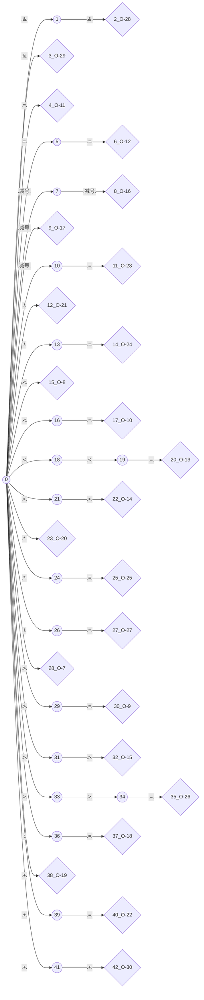

```mermaid
graph LR
id:1((1)) -- .&. --> id:2{2_O-28}
id:0((0)) -- .&. --> id:1((1))
id:0((0)) -- .&. --> id:3{3_O-29}
id:0((0)) -- .=. --> id:4{4_O-11}
id:5((5)) -- .=. --> id:6{6_O-12}
id:0((0)) -- .=. --> id:5((5))
id:7((7)) -- .减号. --> id:8{8_O-16}
id:0((0)) -- .减号. --> id:7((7))
id:0((0)) -- .减号. --> id:9{9_O-17}
id:10((10)) -- .=. --> id:11{11_O-23}
id:0((0)) -- .减号. --> id:10((10))
id:0((0)) -- ./. --> id:12{12_O-21}
id:13((13)) -- .=. --> id:14{14_O-24}
id:0((0)) -- ./. --> id:13((13))
id:0((0)) -- .<. --> id:15{15_O-8}
id:16((16)) -- .=. --> id:17{17_O-10}
id:0((0)) -- .<. --> id:16((16))
id:19((19)) -- .=. --> id:20{20_O-13}
id:18((18)) -- .<. --> id:19((19))
id:0((0)) -- .<. --> id:18((18))
id:21((21)) -- .<. --> id:22{22_O-14}
id:0((0)) -- .<. --> id:21((21))
id:0((0)) -- .*. --> id:23{23_O-20}
id:24((24)) -- .=. --> id:25{25_O-25}
id:0((0)) -- .*. --> id:24((24))
id:26((26)) -- .=. --> id:27{27_O-27}
id:0((0)) -- .!. --> id:26((26))
id:0((0)) -- .>. --> id:28{28_O-7}
id:29((29)) -- .=. --> id:30{30_O-9}
id:0((0)) -- .>. --> id:29((29))
id:31((31)) -- .>. --> id:32{32_O-15}
id:0((0)) -- .>. --> id:31((31))
id:34((34)) -- .=. --> id:35{35_O-26}
id:33((33)) -- .>. --> id:34((34))
id:0((0)) -- .>. --> id:33((33))
id:36((36)) -- .=. --> id:37{37_O-18}
id:0((0)) -- .:. --> id:36((36))
id:0((0)) -- .+. --> id:38{38_O-19}
id:39((39)) -- .=. --> id:40{40_O-22}
id:0((0)) -- .+. --> id:39((39))
id:41((41)) -- .+. --> id:42{42_O-30}
id:0((0)) -- .+. --> id:41((41))
```
