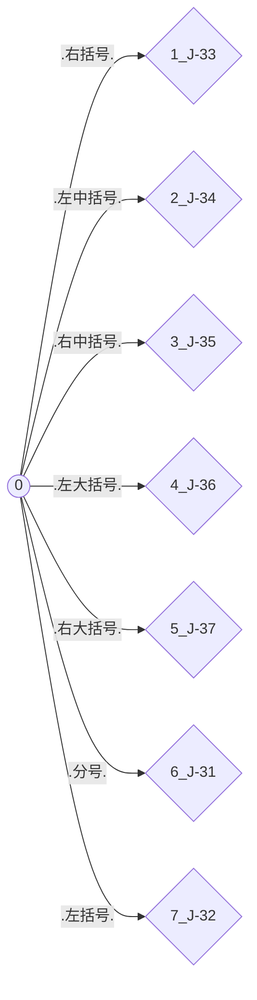

```mermaid
graph LR
id:0((0)) -- .右括号. --> id:1{1_J-33}
id:0((0)) -- .左中括号. --> id:2{2_J-34}
id:0((0)) -- .右中括号. --> id:3{3_J-35}
id:0((0)) -- .左大括号. --> id:4{4_J-36}
id:0((0)) -- .右大括号. --> id:5{5_J-37}
id:0((0)) -- .分号. --> id:6{6_J-31}
id:0((0)) -- .左括号. --> id:7{7_J-32}
```
